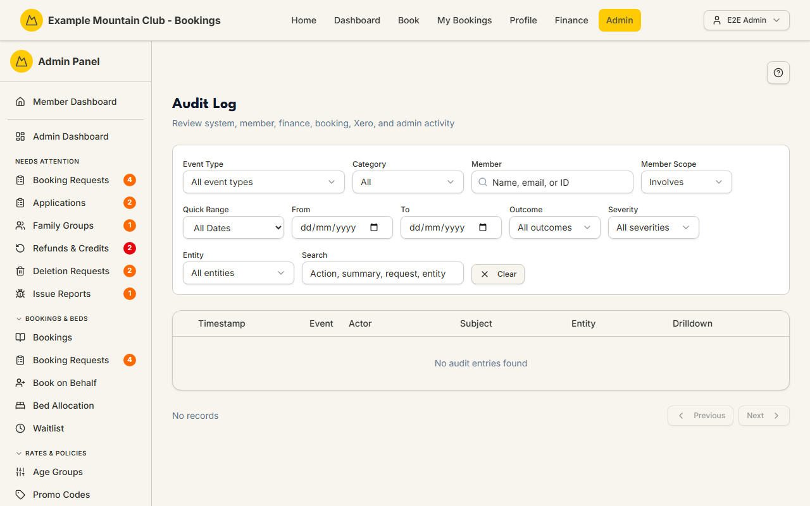

# Audit Log

Audience: Operator

## What it is

A searchable timeline of everything the system records: member, booking,
finance, payment, Xero, admin, security, and privacy activity, each with the
actor who did it, the member it affected, the outcome, and (when present) the
request ID, IP, and retention class. Find it at **Admin → Monitoring & Support → Audit Log**
(`/admin/audit-log`).

The audit log is read-only — you can filter, search, expand a row for its full
detail, and drill through to the member or record it references, but you cannot
edit or delete an entry. Retention and optional archival are governed by the
[`AUDIT_RETENTION_ARCHIVE_RUNBOOK.md`](../AUDIT_RETENTION_ARCHIVE_RUNBOOK.md).

## When you'd use it

- A member asks "who changed my booking / membership / family group, and when?"
- You're investigating a payment, refund, or Xero sync that behaved unexpectedly
  and want the exact sequence of events.
- A security or privacy review needs the record of who accessed or acted on a
  member's data.

## Step-by-step

### Find the events you need

1. Go to **Admin → Audit Log**. The most recent events load first, 25 per page.

   

2. Narrow with the filter bar: pick an **Event Type** or **Category**, search a
   **Member** (and set **Member Scope** to *Involves*, *Actor*, or *Subject*),
   set a **date range**, or filter by **Outcome**, **Severity**, or **Entity**.
   The free-text **Search** matches the action, summary, request ID, or entity.
3. Click a row to expand it for the **Details**, **Metadata**, request ID, IP,
   user agent, retention class, and every drill-down target. Use **Clear** to
   reset all filters.

## Settings reference

The audit log has no editable settings. Its filters:

| Filter | What it does |
| --- | --- |
| Event Type | Restrict to one recorded event action |
| Category | One of account, booking, payment, family, admin, security, lodge, xero, communication, privacy, system |
| Member + Member Scope | A specific member, matched as the actor, the subject, or either (*Involves*) |
| Date range | From/To, with the standard presets |
| Outcome | The recorded result (e.g. success/failure), from the events present |
| Severity | The recorded severity, from the events present |
| Entity | The record type the event touched |
| Search | Free text over action, summary, request ID, and entity |

Each row shows the timestamp, the category/severity/outcome badges, the summary
and machine `action`, the actor, the affected member (subject), the entity, and
primary drill-down links. Expanding a row reveals the request ID, IP, user
agent, **retention class**, raw details, and JSON metadata.

## Troubleshooting

| Symptom | Likely cause | Fix |
| --- | --- | --- |
| No entries found | The active filters exclude everything | Click **Clear**, then re-apply one filter at a time |
| An old event is missing | It aged out under the retention policy (or was archived) | See the [audit retention & archive runbook](../AUDIT_RETENTION_ARCHIVE_RUNBOOK.md) |
| A row won't expand | It has no extra detail (no metadata, request, or IP) | Nothing to show — the summary row is the whole record |
| Actor shows as "System" | The event was performed by a job or deploy, not a person | Expected for cron/webhook/bootstrap activity |

## Related links

- Back to the [documentation hub](../README.md).
- Sibling monitoring guides: [System Health](health.md),
  [Stuck States](stuck-states.md), [Background Jobs](background-jobs.md).
- Reference: [audit retention & archive runbook](../AUDIT_RETENTION_ARCHIVE_RUNBOOK.md).
