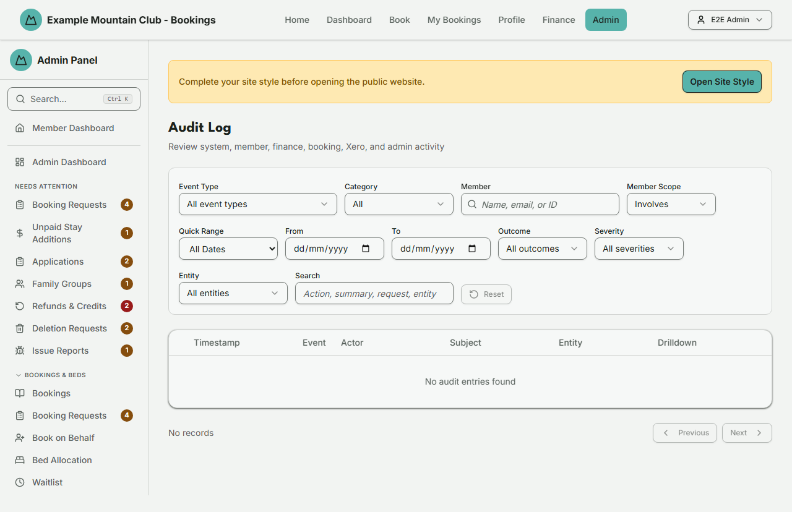

# Audit Log

Audience: Operator

## What it is

A searchable timeline of everything the system records: member, booking,
finance, payment, Xero, admin, security, and privacy activity, each with the
actor who did it, the member it affected, the outcome, and (when present) the
request ID, IP, and retention class. Find it at **Admin → Monitoring & Support → Audit Log**
(`/admin/audit-log`).

The audit log is read-only — you can filter, search, expand a row for its full
detail, and drill through to the member or record it references, but you cannot
edit or delete an entry. Retention and optional archival are governed by the
[`AUDIT_RETENTION_ARCHIVE_RUNBOOK.md`](../AUDIT_RETENTION_ARCHIVE_RUNBOOK.md).

## When you'd use it

- A member asks "who changed my booking / membership / family group, and when?"
- You're investigating a payment, refund, or Xero sync that behaved unexpectedly
  and want the exact sequence of events.
- A security or privacy review needs the record of who accessed or acted on a
  member's data.

## Step-by-step

### Find the events you need

1. Go to **Admin → Audit Log**. The most recent events load first, 25 per page.

   

2. Narrow with the filter bar: pick an **Event Type** or **Category**, search a
   **Member** (and set **Member Scope** to *Involves*, *Actor*, or *Subject*),
   set a **date range**, or filter by **Outcome**, **Severity**, or **Entity**.
   The free-text **Search** matches the action, summary, request ID, or entity.
3. Click a row to expand it for the **Details**, **Metadata**, request ID, IP,
   user agent, retention class, and every drill-down target. Use **Reset** to
   restore search, filters, and page while keeping unrelated URL context.

## Settings reference

The audit log has no editable settings. Its filters:

| Filter | What it does |
| --- | --- |
| Event Type | Restrict to one recorded event action |
| Category | One of account, booking, payment, family, admin, security, lodge, xero, communication, privacy, system |
| Member + Member Scope | A specific member, matched as the actor, the subject, or either (*Involves*) |
| Date range | From/To, with the standard presets |
| Outcome | The recorded result (e.g. success/failure), from the events present |
| Severity | The recorded severity, from the events present |
| Entity | The record type the event touched |
| Search | Free text over action, summary, request ID, and entity |

Each row shows the timestamp, the category/severity/outcome badges, the summary
and machine `action`, the actor, the affected member (subject), the entity, and
primary drill-down links. Expanding a row reveals the request ID, IP, user
agent, **retention class**, raw details, and JSON metadata.

### Categories, and what they are actually for

The **Category** on an entry is not a colour or a label for tidiness. It is the
only thing a *filtered* reader can filter on, so it decides two things: what the
Category filter above finds, and — for anyone using **AI Diagnostics** — which
permission somebody needs before the assistant will show them the event at all.

There are eleven, and each one belongs to exactly one AI Diagnostics area:

| Category | What records there | Who can correlate it in AI Diagnostics |
| --- | --- | --- |
| `admin` | The **catch-all for anything an administrator did** that has no narrower home — member merges, lifecycle decisions, imports, seasonal assignments, booking message wording, internet-banking settings, and settings for chores, lockers, work parties, lodges and lodge instructions. Still the largest category by a long way | Support only |
| `security` | Credentials, password and magic-link policy, PIN login, sign-in problems, AI Diagnostics use itself, **sending a member a password reset or a setup invite**, and **bulk role changes** | Support only |
| `system` | Setup, backups, platform-level events | Support only |
| `booking` | Member-facing and automatic booking events, **and the booking rules themselves** — booking policies, booking periods, age tiers, seasons and promotional codes | Support **+ Bookings** |
| `payment` | Charges, refunds, credits, settlements, **subscription billing, member credit adjustments and fee configuration** | Support **+ Finance** |
| `xero` | Xero sync, mappings, reconciliation, **settings, replays and retries** | Support **+ Finance** |
| `lodge` | Rosters, guest arrival and departure, **all bed allocation** — an administrator's manual, bulk, range and approval actions as well as the automatic ones — **display layouts, templates, devices and the lodge display configuration, lodge kiosk accounts**, and **induction** (even though Induction sits under Membership) | Support **+ Lodge** |
| `account` | A member's own record: profile edits, notification preferences, membership cancellation, photos, **membership applications and nominations**, and **bulk activate/deactivate** | Support **+ Membership** |
| `family` | Family groups, partner links, login-holder changes, **dependant links and unlinks** | Support **+ Membership** |
| `communication` | Bulk email, member notices, **delivery-suppression clearances**, credential-email reissues | Support **+ Membership** |
| `privacy` | **Deletion requests and the decisions on them**, member exports, member-guest lookups, **issue reports** (even though Issue Reports sits under Support) | Support **+ Membership** |

**Two of those rows changed in this release, and both change who can see what.**

- **Communication entries now need Membership access to correlate**, not Support
  alone. Somebody with Support access only can no longer pull bulk-email or
  notice-delivery history through AI Diagnostics. That is deliberate: those
  entries carry the recipients' email addresses, so they are membership
  information, not general support information.
- **Family entries can now be correlated at all.** They previously belonged to no
  AI Diagnostics area, so family-group, partner-link and login-holder history was
  invisible to every one of its tools. It is now readable with Support plus
  Membership.

**Bed allocation also changed category in this release, and that changes who can
correlate it.** It used to be filed two ways depending on who started it: the
automatic promotions the platform performs when a booking changes were `lodge`,
and the manual, bulk and range allocations an administrator performed were
`admin`. Nobody could get a complete answer — a Lodge Manager pulling
bed-allocation history got the automatic half and no sign that a manual half
existed. **All of it is `lodge` now**, together with the lodge display
configuration, which was the last display setting still filed as `admin`.

If you hold Support access only, you could pull that history through AI
Diagnostics before and now you will need Lodge access too. **This screen is
unaffected** — Admin → Audit Log still shows every entry to anyone with Support
access, and the Category filter simply lists those entries under **Lodge**
instead of **Admin**.

Neither change affects this screen. **Admin → Audit Log shows every entry to
anyone with Support access**, exactly as before — the categories above only
govern the AI Diagnostics tools, which are deliberately narrower.

**A larger set of entries moved in this release**, because 82 kinds of entry that
had never carried a category were given one. The bold items in the table above are
the new arrivals. Four things are worth an operator's attention:

- **Booking rules are now under Bookings.** A booking-policy, booking-period,
  age-tier, season or promotional-code change correlates through the Bookings
  tool. Nobody loses anything: these entries had no category at all before, so no
  AI Diagnostics tool could find them, whoever you were.
- **Money settings are now under Finance.** Subscription-billing changes, member
  credit adjustments and fee configuration correlate through the Finance tool, on
  the same "nobody loses anything" footing.
- **Only three kinds of entry joined the Support-only categories**: sending a
  member a password reset, sending a setup invite, and a bulk role change. All
  three are about a *credential or a permission*, which is why they are `security`
  rather than `communication` or `account`. AI Diagnostics never returns the
  stored details of an entry — only the action, category, severity, outcome, what
  kind of record it concerned and when — so the recipient's email address in those
  entries does not travel with them.
- **A few kinds of entry also change which Category filter finds them, so this is
  not purely a list of arrivals.** An entry with no category is placed by
  guesswork on its action name, and that guess can file one entry under *several*
  filters at once; an entry that carries a category is returned by that category
  and by **All**, and by nothing else. So: card payment results on a booking move
  out of **Bookings** into **Payments**; password resets, setup invites and bulk
  role changes move out of **Account** into **Security**; clearing a delivery
  suppression moves out of **Account** into **Communication**; credit
  adjustments, dependant links and unlinks, and deletion requests and the
  decisions on them stop doubling up under **Account** and now appear only under
  **Payments**, **Family** and **Privacy** respectively; and a login-holder swap
  stops doubling up under **Security** and appears only under **Family**. Nothing
  became unreadable — every one of these is still returned by **All** and by its
  own category — but the practical effect is worth knowing: on one member's
  timeline the Bookings filter will show their *older* payment results and not
  their newer ones, which is the same kind of event filed correctly rather than
  an entry going missing.

**One thing to expect on the member side.** Members see a slice of their own
activity on their profile page, and that slice is also chosen by category —
Account, Bookings, Payments, Family, Security, Communication and Privacy, never
Admin, Lodge, Xero or System. Three sets of entries were recorded under category
names that did not exist (`membership` on membership applications, `auth` on
sign-in bounces) or under `admin` (an administrator changing a member's photo for
them), so members could not see them; corrected to real categories, they now
appear. Each entry concerns the member reading it, and a member's view never
shows the stored metadata, the request ID, the IP address, the user agent, the
retention class or any drill-down link. It **does** show the entry's own
free-text line where it has one: that line is dropped only when what the entry
recorded is structured data rather than a sentence, which is a property of the
entry and not of who is reading it. (One size caveat, because it is easy to
miss: structured data long enough to be clipped at the platform's
1000-character limit stops reading as structured, so a very long payload comes
back as the clipped text.) If a member asks why sign-in entries have started
appearing, that is why.

**A second thing on the member side, from this release.** Twenty-six of the kinds
of entry that gained a category are now inside the member-visible slice when they
were not before. Almost all of them are club-wide rules — booking policies,
seasons, promotional codes, subscription-billing settings — recorded against the
administrator who made the change, so the only member timeline they reach is that
administrator's own. Two reach an ordinary member, and both are about that member:
an **issue report** appears for the member who filed it, and a change to a
member's **billing family** appears for the member it was made for. Neither shows
the request ID, the IP or any drill-down link, and neither normally shows the
stored details either — both record structured data rather than a sentence, which
a member's view drops. The one exception is size: an issue report records the
page address and title the member was on, and a page address long enough to push
that past the 1000-character clip stops reading as structured, so the clipped
text is shown. What that shows the member is their own page address and title, so
nothing travels that should not; the billing-family entry is nowhere near the
limit. **They do name who acted, unless that person is a Full Admin.** A member's
view renders a Full
Admin as "Club admin", but a scoped officer — a Finance Manager, say, who is not
a Full Admin — is rendered by name. That is how every entry a member can already
see has always worked; the billing-family entry is simply one more of them. If
your club would rather scoped officers were anonymous on the member timeline,
that is a change to the member view, not to these categories. Nothing that a
member should not see about themselves became visible, and nothing stopped being
visible to anybody. What *did* change for some entries is which Category filter
returns them — the fourth bullet above lists the moves, and they apply on a
member's own timeline too.

Two mismatches are worth remembering when you search, because they look like
mistakes and are not. **Induction** entries are `lodge`, not membership. **Issue
report** entries are `privacy`, not admin. Both follow the *information* in the
entry rather than the menu the screen sits under, and both are left that way on
purpose — filing issue reports under `admin` would have made them readable by
more people, not fewer.

### Some entries have no category at all

`Category` is optional in the database, and **82 of the platform's places that
record an audit entry used not to set one**. As of this release **none do**: all
427 now record a category, measured on every build rather than estimated.

**And a new one can no longer forget.** Recording an entry without a category is
now refused three separate ways. Giving the 82 places a category and stopping the
*next* one being written the same way were two separate pieces of work, done in
that order and both landing in this release; this is the second:

1. **It does not compile.** The category is a required field on both ways the
   platform records an entry, so a developer who leaves it out gets an error
   before the code runs at all.
2. **It is refused at the moment of writing.** If a category reaches the
   recording step that is not one of the eleven on this page — a typo, an
   invented name, an empty value — the entry is refused rather than stored
   unreadable. Where that entry is part of a change being saved, the change is
   abandoned with it, which is the same thing that already happens if the entry
   cannot be written for any other reason: the record and the change it describes
   succeed together or not at all.
3. **The build still counts them**, for the two kinds of writer the first two
   cannot see — a database migration writing the table directly, and a
   maintenance script outside the normal path.

The practical effect for you: an entry recorded the ordinary way — through the
platform's own recording step, which is how every one of the 427 places does it —
cannot be born without a category any more. **It is not a mathematical
guarantee**, and it is worth saying so rather than overclaiming: someone writing
directly to the database table in a migration, or building a query by hand, is
outside the first two refusals, which is exactly what the third one is for. Six
specific ways of slipping past the build's count were found while reviewing this
change and all six were closed, each with its own test. Your **older** history is
a different matter, and the rest of this section is about that.

**Entries recorded before this release still have no category**, and there is no
way to tell from the entry itself. Filling those in is a separate change, done
once and reviewed on its own, and it has not happened yet — so everything below
still applies to your older history.

**On this screen every one of those entries is still listed**, and the Category
filter tries to place them: when you pick a category it also matches
uncategorised entries whose action *looks* like that category, so filtering by
*Payments* does find a credit adjustment that recorded no category. Treat that as
a helpful guess rather than a guarantee — it is pattern-matching on the action
name, it has no rules at all for *System*, and it will miss, for example, an
uncategorised display-layout change under *Lodge*. **If you are looking for
something specific and the category filter comes up short, clear it and search by
event type, member or date instead** — the entry is there.

**In AI Diagnostics it costs a lot.** Those tools filter on the stored category
and nothing else, so an entry without one is returned by none of them. If you ask
the assistant about a subscription reconcile or a booking-policy change and it
says nothing matched, that is not evidence it did not happen — it means no
*categorised* entry matched. The assistant is told to say so and to point you
here. **Always confirm on this screen before concluding an event did not occur.**

This has been fixed at the source, over three changes: the categories and the
automated count landed first, giving each of those 82 places a category landed in
this release, and filling in the historical entries is last and still to come.
Until it does, treat an empty AI Diagnostics result as "look in Admin → Audit
Log", never as "it did not happen".

**The retention change this release makes, stated plainly because it is real.**
An entry recorded with no category also got no retention class and no expiry, so
those entries were kept indefinitely rather than aging out. Now that all 82 kinds
record a category, **new** entries of those kinds are classified `critical` and
carry a **seven-year** expiry from the day they are recorded — the longest class
the platform has, and the same one a booking or payment entry already gets. Two
things follow: nothing is deleted sooner than seven years from now because of
this, and **entries already in the database are untouched** — they keep their
missing retention class until the historical change decides what to do about
them. If your club needs some of these kept beyond seven years, say so before
that horizon; it is a setting, not a law.

**What "expires" means for these entries: deletion, not filing.** The archive
only takes the two shorter-lived classes, so a `critical` entry is never copied
anywhere — at seven years it is deleted outright and there is no second copy to
go back to. That is already true of every booking and payment entry, so it is not
new; it is worth knowing here because it now also covers the record of a
**deletion decision**.

**What that does and does not put at risk**, because it is easy to overstate.
The deletion *request* itself survives: approving one anonymises the member's own
record in place rather than deleting it, so the request stays on file — which
member asked, that the club approved it, and when — with no expiry of its own.
What only the activity entry holds is the administrator's IP address, how many
future bookings the erasure cancelled, and which family links it detached. Add
*who* approved it whenever the approval had no bookings to cancel: that case is
finalised in one step and records the outcome on the request without stamping the
reviewer on it, so the activity entry is the only attribution. Seven years is a
long time and nothing goes before 2033, but if the club wants that particular
record kept permanently, it is a one-line change at the writer and it should be
made deliberately rather than discovered in 2033.

### Booking-policy entries

From this release, a `group-discount.update`, `cancellation-policy.update`,
`booking-period.update`, or `minimum-stay-policy.update` entry recorded **from
the admin screens** always reflects a real change: the Booking Policies forms
keep **Save** disabled until the form actually differs from what is stored, so
opening **Edit** and saving without touching anything can no longer write an
entry.

The same now holds for the row-level **Activate** / **Deactivate** buttons on
booking periods and minimum-stay policies, which write through the same two
`*.update` actions. Those are not form saves — they are one-click writes — so
they were never covered by the Save gate; a quick double-click used to send the
same new value twice and record the second as an update whose `before` and
`after` were identical. Each button is now disabled for the round trip and
guarded against a repeat click, so one click is one entry.

The red **Delete** button on a minimum-stay policy records
`minimum-stay-policy.delete`, not an `*.update`. It is a **soft** delete: the
policy is marked inactive and stops applying, but the row is kept and stays
listed in the admin screen, where **Activate** can bring it back. Read the
entry as "taken out of use", not as "erased".

Two caveats. Entries recorded *before* this release may still be no-ops, so
treat an older pair of identical `before`/`after` values as "nothing changed"
rather than as a mystery. And the guarantee is a property of the admin screens,
not of the write routes — a script or integration calling the API directly with
`bookings:edit` can still submit an unchanged body and get an entry.

### Expected arrival time entries (#2621)

From this release, setting or clearing a booking's **expected arrival time**
records an entry — `booking.expected_arrival_time.set` or
`booking.expected_arrival_time.cleared`, both in the **Booking** category, so
filtering the action on `booking.expected_arrival_time` returns the field's whole
history on a booking rather than only the changes that added a value. Before this
release neither wrote anything at all, so **there is no history for changes made
earlier**: no entries on an older booking means the field was never audited, not
that nobody touched it.

Three things the entry tells you that the field itself cannot.

- **Who it is about is the booking's owner, not whoever pressed the button.** A
  Full Administrator or Booking Officer may set the time on any member's booking,
  so the member you search for under **Member Scope → Subject** is the owner; the
  actor column names the person who made the change. The metadata also carries
  `onBehalf`, which is `true` when an officer changed it for the member and
  `false` when the member changed their own — the same flag member-photo entries
  use for the same owner-or-admin pair, so you read it the same way.
- **What it changed from.** Both entries show `old → new` in **Details**, using
  the stored 24-hour form — a first-ever set reads `(not set) → 17:30`, and a
  clear reads `17:30 → (not set)` — with the same pair in metadata as
  `previousExpectedArrivalTime` and
  `newExpectedArrivalTime`. The **cleared** entry is the important one: clearing
  overwrites the only copy of the time, so that entry is the only way to find out
  what a booking's arrival time used to say.
- **That the pair is trustworthy under concurrent edits.** The old value is read
  inside the same database transaction as the write, so if two people save at the
  same moment the two entries chain honestly (`A → B`, then `B → C`) instead of
  both claiming to have replaced `A`.

Entries are written only after the change is saved, so a refused change records
nothing at all — a time outside the allowed values (the field takes the hour or
the half hour), a booking already past its check-in date, a cancelled or
completed booking, or a caller without permission.

### Member-guest entries (#2308 / #2388)

The "+ Add Member Guest" feature writes four `privacy`-category actions. Two of
them contain things you should know are there before you give somebody audit
access.

| Action | Written when | What it contains |
| --- | --- | --- |
| `member_guest.resolve_email` | Every time a member looks another member up by email address in the booking wizard — including when nothing was found, and when they hit the speed limit | **The full email address they typed**, and how many people it matched. The address is stored deliberately: a domain alone cannot tell probing one household from probing forty. Kept for two years (`sensitive_access`) |
| `member_guest.search` | Every name-search keystroke batch, where the club turned name search on — including fragments too short to run a query, and blocked ones | **The name fragment they typed** (up to 64 characters), the number of results, and whether the list was truncated. Kept for ninety days (`diagnostic_high_volume`), because this is the high-volume one |
| `member_guest.add_refused` | Every time a member is refused when adding somebody outside their own family group | The member who tried and the member they tried to add. Kept for two years |
| `member_guest.repeated_refusal` | When one member has been refused several times in 24 hours against the **same** other member. **Once per pair per 24 hours** — it is raised on the crossing, not on every refusal after it | Both members, and the count at the moment it was raised. Severity **important**, so it stands out |

**Be clear about the first two with your committee.** Anyone who can read the
audit log can see the email addresses and names members typed into the finder.
That is the price of being able to detect somebody working through the roll, and
it is why the search settings ship off.

**A `member_guest.repeated_refusal` entry is not an alarm and nothing was
blocked.** By an explicit owner decision, repeated refusals are recorded for a
person to look at and never acted on automatically: a member trying five
different weekends to find one that suits a friend produces exactly the same
pattern as somebody probing, and only a human who knows both people can tell
them apart. Treat it as a conversation to have if it keeps happening.

## Troubleshooting

| Symptom | Likely cause | Fix |
| --- | --- | --- |
| No entries found | The active filters exclude everything | Click **Reset**, then re-apply one filter at a time |
| An old event is missing | It aged out under the retention policy (or was archived) | See the [audit retention & archive runbook](../AUDIT_RETENTION_ARCHIVE_RUNBOOK.md) |
| A row won't expand | It has no extra detail (no metadata, request, or IP) | Nothing to show — the summary row is the whole record |
| Actor shows as "System" | The event was performed by a job or deploy, not a person | Expected for cron/webhook/bootstrap activity |

## Related links

- Back to the [documentation hub](../README.md).
- Sibling monitoring guides: [System Health](health.md),
  [Stuck States](stuck-states.md), [Background Jobs](background-jobs.md).
- Reference: [audit retention & archive runbook](../AUDIT_RETENTION_ARCHIVE_RUNBOOK.md).
