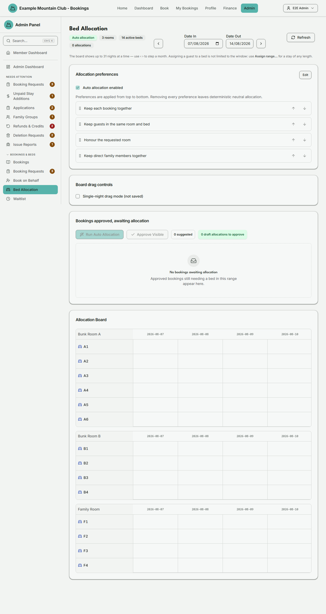

# Bed Allocation

Audience: Operator

## What it is

A drag-and-drop board for placing approved bookings' guests onto individual beds
across a range of nights. You can let the system suggest placements
automatically, drag guests onto beds yourself, and approve the resulting
allocation. Find it at **Admin → Bookings & Beds → Bed Allocation**
(`/admin/bed-allocation`).

Bed allocation is gated by the **`bedAllocation`** module — when it is on, each
lodge's capacity is its active bed count. Editing needs **bookings edit**
access; a view-only bookings role can browse the board but not move, allocate,
approve, or save. Dates are NZ date-only lodge nights, and the board shows up to
31 nights at a time — use the **‹** and **›** arrows to step the window a
calendar month. That 31-night limit is only how much of the board you can *see*:
**Assign range…** places a guest in a bed across a stay of any length (up to a
year in one go).

## When you'd use it

- The night before a busy weekend, to assign every guest to a specific bed.
- To put one guest in the same bed for a long stay in a single action, instead
  of dragging night by night across several board loads.
- To let the system auto-allocate approved bookings, then review and approve.
- To move a guest from one bed to another, or free a bed by unallocating.
- To check which beds are free on a given night.

## Step-by-step

### Open the board and set the dates

1. Go to **Admin → Bookings & Beds → Bed Allocation**. Set **Date In** and
   **Date Out** (the window is capped at 31 nights) and click **Refresh** if
   needed. The header badges show the mode, room count, active bed count, and
   how many allocations exist.
2. Press **‹** or **›** to move the whole window one calendar month at a time.
   Because months differ in length, a stepped window is occasionally trimmed
   back to 31 nights; when that happens the board says so.
3. If you type a window longer than 31 nights the board **refuses it and tells
   you** rather than quietly shortening it — narrow the dates, or step by month.
   When you arrive from a booking's "Bed allocation" link and that booking is
   longer than 31 nights, the board shows the first 31 nights and says it is
   showing part of the stay.

   

### Choose the allocation mode

1. In the **Allocation Mode** card, tick **Auto allocation enabled** to let the
   system propose placements, and optionally **Single-night drag mode** (when
   on, dragging a guest allocates only the night you drop on; when off, dropping
   allocates the guest's whole stay). Click **Save Mode**.

### Auto-allocate and approve

1. In **Bookings approved, awaiting allocation**, click **Run Auto Allocation**
   to apply the suggested placements (this button is available when
   auto-allocation is on and there are suggestions).
2. Review the resulting draft placements on the Allocation Board, then click
   **Approve Visible** to approve them. The "N draft allocations to approve"
   badge tracks how many are still draft.

### Allocate a guest by hand

1. In the awaiting-allocation pool, use a guest's **Select bed** dropdown and
   click **Allocate**, or drag the guest chip onto a bed cell on the
   **Allocation Board**.
2. To move a placed guest, drag their chip to another bed/night, or use the
   chip's menu → **Move to bed**. To free a bed, drag the chip back to the pool
   or use **Remove allocation**.

### Assign a guest to one bed for a long stay

1. Click **Assign range…** — on a guest's row in the awaiting-allocation pool,
   or from an already-placed chip's menu on the board (which prefills that
   guest and bed).
2. Pick the bed, then the first night (**Date In**) and the checkout date
   (**Date Out**). The dialog shows the night count as you type. There is no
   31-night limit here; the maximum is a year in one action.
3. Click **Assign**. The whole range is written at once, or not at all.
   **Assigning a range confirms those beds immediately**, which locks the
   member out of changing their requested room for that booking — the dialog
   warns you before you commit.
4. If any night is blocked, **nothing is written** and the dialog lists every
   blocked night under one of three headings:
   - **Bed already allocated** — someone else is in that bed. The occupying
     guest is named, and a **Provisional** badge marks an occupant whose
     booking does not hold the night. Provisional or not, it is a clash:
     nothing is overwritten without you saying so.
   - **Guest is not booked that night** — this is not a clash. It means the
     range or the guest is wrong, so check the dates rather than working
     around it.
   - **Whole-lodge hold** — *this* booking has taken the whole lodge for those
     nights, so its guests need no individual beds. (Someone *else's*
     whole-lodge hold does not block you here; the board shows it as a banner
     and a badge so you can see the clash and decide.)
5. If some nights are free, a second button appears — **Assign the N free
   nights** — stating exactly how many it will write, and it sends exactly the
   nights listed. If one of them has been taken in the meantime, the whole thing
   is refused again with a fresh list rather than quietly writing fewer. That is
   the only way a range lands partly done, and it is a deliberate choice, never
   a default.
6. If any night was refused as **Guest is not booked that night**, that button
   asks you to confirm first: it names how many nights are not part of this
   guest's booking and will *not* be assigned, and how many will, and waits for
   you to say **Yes, assign the N free nights**. **Go back** returns to the
   list, and changing the dates clears it — nothing is written until you
   confirm. Those nights are the one refusal that usually means a typo, so
   skipping them is a choice you read and make, not a button next to a warning.
7. Afterwards the board tints the nights it wrote green (**Assigned**) and the
   nights it refused red (**Refused**) on that bed, with a summary you can
   dismiss when you have finished checking the gaps.

Every range assignment — whether it succeeded, was refused, or wrote only the
nights you chose — records a **single** entry in the audit log against the
booking, covering the range you asked for, what was written, and what was
refused. It records the counts and the dates, not other members' names: those
appear on screen for you, and are not filed away. If moving the guest left a
partner alone on a shared double, one further entry records every partner
promoted by that action together, rather than one entry per partner.

## Settings reference

| Control | What it does | Default | Notes / constraints |
| --- | --- | --- | --- |
| Date In / Date Out | The night range shown on the board | today to today + 7 | NZ date-only; window capped at 31 nights and refused (not shortened) if longer |
| ‹ / › month steppers | Move the whole board window one calendar month | — | Window is trimmed back to 31 nights when a month change widens it, and says so |
| Assign range… | Place one guest in one bed across a stay of any length | — | Up to 366 nights; all-or-nothing, then an explicit free-nights option; auto-approves the beds |
| Auto allocation enabled | Let the system propose bed placements | as saved | Persisted setting; enables Run Auto Allocation |
| Single-night drag mode | Drag allocates one night vs the whole stay | off | Client-side only, not saved |
| Save Mode | Persist the auto-allocation setting | — | — |
| Run Auto Allocation | Apply suggested placements | — | Needs auto-allocation on and suggestions available |
| Approve Visible | Approve the visible draft allocations | — | Disabled when nothing is unapproved |
| Select bed / Allocate | Place a guest on a chosen bed | — | Needs bookings edit access |
| Refresh | Reload the board | — | — |
| Lodge selector | Which lodge's board is shown | first/only lodge | Only shown with more than one active lodge |

Notes: bed types (single, bunk top/bottom, double) are descriptive and do not
change capacity; a double bed-night can hold two occupants (declared partners).
Bookings that hold an **exclusive whole-lodge hold** are not placed on
individual beds — the whole lodge is taken for their nights. Setting a hold on a
booking therefore **removes the bed assignments it already has**, including any
you placed by hand and any that were approved; the removed assignments are
recorded in the audit log, so you can rebuild them if the hold turns out to be a
mistake. Clearing a hold makes the booking ordinary again and re-plans its beds
automatically — but only when **Auto allocation enabled** is on. With
auto-allocation off, the guests come back to the awaiting-allocation list and
you place them yourself.

## Troubleshooting

| Symptom | Likely cause | Fix |
| --- | --- | --- |
| A view-only notice, drag disabled | Your admin role can view but not edit bed allocation | Ask a full admin for bookings edit access |
| Bed Allocation is missing from the sidebar | The `bedAllocation` module is off | Enable it under **Admin → Setup → Modules** — see [`CONFIGURATION.md`](../../CONFIGURATION.md#module-controls-and-admin-modules) |
| **Run Auto Allocation** is disabled | Auto-allocation is off, or there are no suggestions | Tick **Auto allocation enabled** and **Save Mode**, then refresh |
| "No rooms available" / "No active beds" | Rooms and beds are not set up | Configure them in **Rooms & Beds** (via [Bookings Setup](bookings-setup.md)) |
| "That bed was just taken … refreshing" | Someone else allocated that bed-night at the same moment | The board reloads automatically; pick another bed |
| A focused booking is "not on the board" | The deep-linked booking is outside the date range or was cancelled | Adjust Date In / Date Out to bring it into view |
| "The board window is out of range" | You typed more than 31 nights, or a Date Out before Date In | Narrow the dates, or use ‹ › to step a month at a time |
| "Showing part of this stay" | You followed a link for a booking longer than the board window | Step forward with › to see the rest of the stay |
| A range assign says "Nothing was written" | At least one night is blocked — bed taken, guest not booked, or a whole-lodge hold | Read the three lists; fix the range, or use **Assign the N free nights** to take just the free ones (if any night is outside the guest's stay, you are asked to confirm that first) |
| A range assign is refused on every night | This booking has an exclusive whole-lodge hold | Held bookings take the whole lodge and get no individual beds — remove the hold first if that is wrong |
| "That took too long to save" | The range was large enough for the save to time out; nothing was written | Split it into shorter ranges and assign them one after the other |
| The member says they can no longer change their requested room | A range assign approved their beds | That is expected: confirming beds locks the room request. Removing every approved allocation re-opens it |

## Related links

- Back to the [documentation hub](../README.md).
- Sibling guides: [Bookings](bookings.md), [Waitlist](waitlist.md),
  [Bookings Setup](bookings-setup.md).
- Reference: the
  [bed allocation lifecycle](../STATE_MACHINES.md#bed-allocation-lifecycle), the
  [capacity model](../CAPACITY_MODEL.md#two-distinct-quantities) and its
  [admin surface](../CAPACITY_MODEL.md#admin-surface), and the
  [capacity locking discipline](../CONCURRENCY_AND_LOCKING.md#capacity-who-claims-who-releases-under-which-lock).
