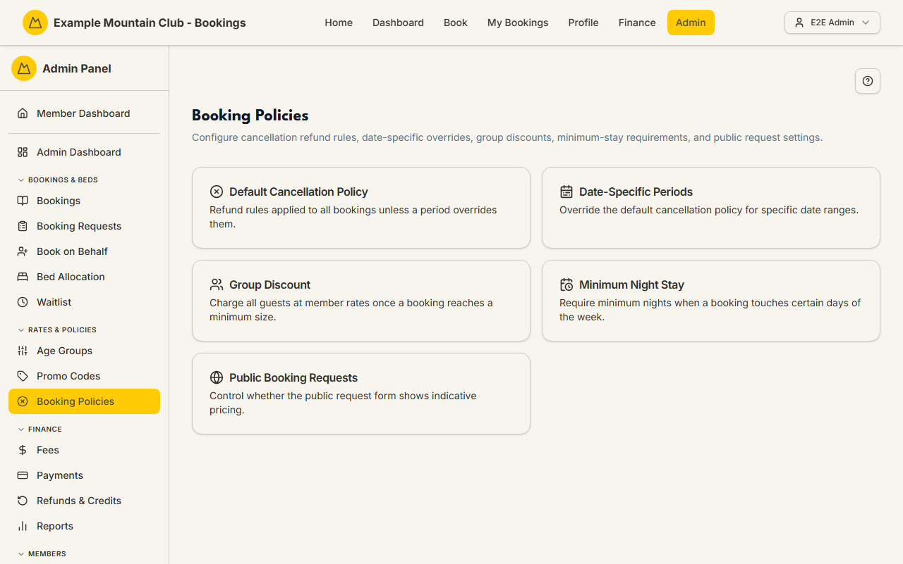
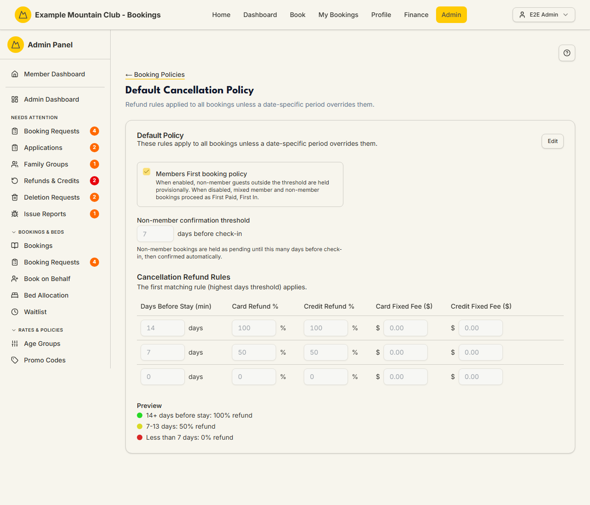
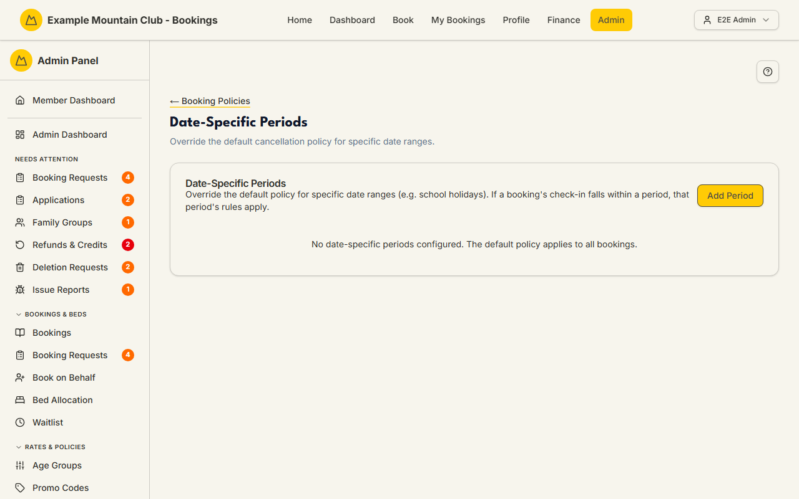
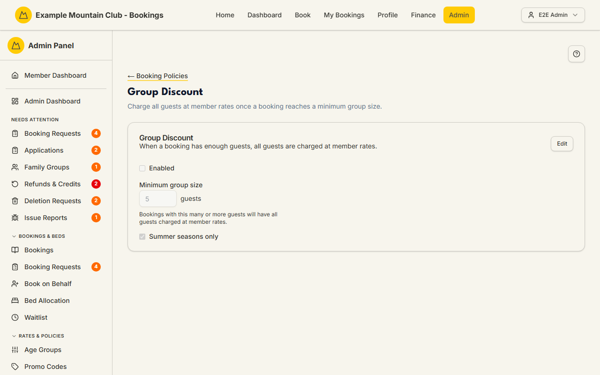
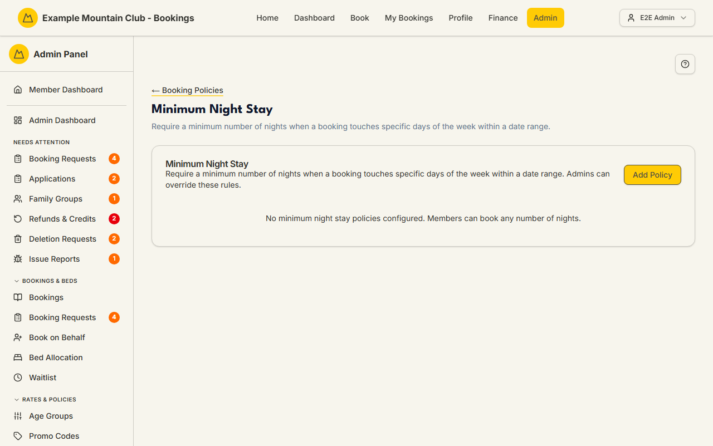
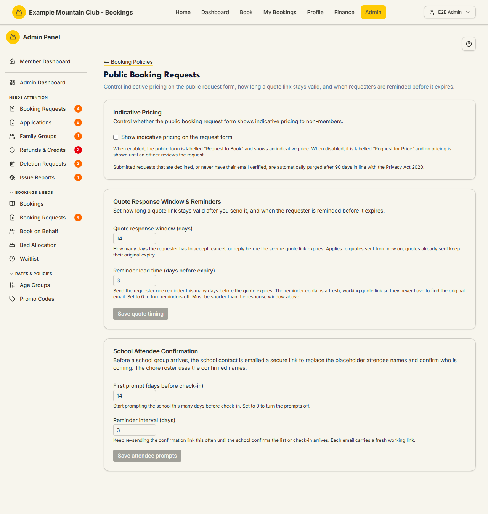

# Booking Policies

Audience: Operator

## What it is

The hub for the rules that shape how bookings are priced, held, and refunded.
Five sub-pages sit under it:

- **Default Cancellation Policy** — the club-wide refund schedule and the
  "Members First" non-member hold.
- **Date-Specific Periods** — override the cancellation policy for named date
  ranges (for example school holidays).
- **Group Discount** — charge everyone at member rates once a booking is big
  enough.
- **Minimum Night Stay** — require a minimum number of nights when a booking
  touches certain days.
- **Public Booking Requests** — control indicative pricing and quote timing on
  the public request form.

Find it at **Admin → Rates & Policies → Booking Policies**
(`/admin/booking-policies`). Every setting here needs **bookings edit** access;
a view-only role can read the policies but not change them.

All money is integer cents (entered as dollars); all dates are NZ date-only
lodge nights. When the club runs more than one lodge, a **Rules for** selector
lets you set per-lodge overrides that *replace* (never merge with) the club-wide
rules — see
[`CONFIGURATION.md`](../../CONFIGURATION.md#adding-a-second-lodge).

## When you'd use it

- You need to change how much of a booking is refunded when a member cancels.
- A busy period (school holidays, a race weekend) needs stricter refund rules or
  a minimum stay.
- You want large bookings to be charged entirely at member rates.
- You want to turn indicative pricing on or off for the public request form, or
  change how long a quote stays valid.

## Step-by-step

### Open the hub

1. Go to **Admin → Rates & Policies → Booking Policies**. Pick one of the five
   cards.

   

   <!--
     The hub now carries a sixth card, Adult Member Hosting. Its own page is
     registered for capture as `admin-booking-policies-adult-member-hosting`
     (e2e/tools/capture-screenshots.ts); both images are refreshed by the usual
     capture run against a seeded stack, which this change could not perform.
   -->

### Default Cancellation Policy

1. Open **Default Cancellation Policy** and click **Edit**.

   

2. Set the **Members First booking policy** toggle. When on, non-member guests
   outside the threshold are held provisionally; when off, mixed bookings run as
   "First Paid, First In".
3. Set the **Non-member confirmation threshold** (days before check-in) that
   controls how long non-member bookings stay pending.
4. Edit the **Cancellation Refund Rules** table — one row per "days before
   stay" threshold, each with a card refund %, credit refund %, and optional
   fixed fees. The **Preview** restates the rules in plain English (for example
   "14+ days before stay: 100% refund"). Click **Save Default Policy**. Save
   stays greyed out until you actually change something, so opening **Edit**
   and clicking **Save** without touching a field never records a policy change
   you did not make. On a club that has never saved a cancellation policy, Save
   is available straight away so you can commit the starting rules once.
   **Cancel** puts every field back exactly as it was saved.

### Date-Specific Periods

1. Open **Date-Specific Periods** and click **Add Period**.

   

2. Give the period a name, start and end dates, its own hold setting, and its
   own refund rules, then click **Create Period**. Any booking whose check-in
   falls inside the period uses these rules instead of the default.
3. To change an existing period, click its **Edit** button. **Update Period**
   stays greyed out until you actually change something, so re-saving an
   untouched period never records a change you did not make. **Cancel** closes
   the editor and leaves the period as it was.

### Group Discount

1. Open **Group Discount** and click **Edit**.

   

2. Tick **Enabled**, set the **Minimum group size** (the number of guests at
   which the whole booking is charged at member rates), and optionally
   **Summer seasons only**. Click **Save Group Discount**. The Save button stays
   greyed out until you actually change something, so opening **Edit** and
   clicking **Save** without touching a field never records a policy change you
   did not make. On a club that has never saved this policy, Save is available
   straight away so you can commit the defaults once and have the setup
   checklist show the group discount as configured.

### Minimum Night Stay

1. Open **Minimum Night Stay** and click **Add Policy**.

   

2. Name the policy, set the minimum nights, the date range, and which
   **Trigger Days** (Sun–Sat) activate it. Choose **Exception capacity
   handling** explicitly:

   - **Hold requested capacity during review** means the planned exception
     review will reserve the affected beds while the club decides.
   - **Do not hold capacity until approval** means an exception request will
     reserve no beds until it is approved.

   Click **Create Policy**. The minimum stay applies whenever a booking includes
   any trigger day in the range. Existing policies start in **Hold** mode.
   This release stores, transfers, and publishes the choice, but a member who
   hits the rule is still stopped; submitting and approving exception requests
   arrives in the follow-up review workflow. The rule is applied wherever a
   member commits to nights: making a booking, changing the dates of an existing
   one, and joining a group booking — including a non-member signing up through
   a group's public link, who is checked both when they ask to join and again
   when they click the confirmation email, so a rule you tighten in between is
   honoured, and accepting a waitlist offer — including an offer for a different
   lodge, which is checked against that lodge's own rules. Admins and booking
   officers can still override the rule when booking or editing **on behalf of**
   a member; an admin booking for themselves is held to it like anyone else.
3. Your choice is stored, carried by configuration transfer, and shown on this
   card, but it is **not** published yet. The public booking-rules block lists
   each rule's nights, dates and trigger days only — it says nothing about
   exception capacity until members can actually request an exception, so
   nothing on your public pages promises a process that does not exist.
4. To change an existing policy, click its **Edit** button. **Update Policy**
   stays greyed out until you actually change something — including trigger
   days, where ticking a day and unticking it again counts as no change.
   Each save carries the row revision you loaded. If another admin or a config
   import changes it first, your stale save is refused and the current row is
   reloaded; reopen **Edit** and apply your change to that version.
5. Each row carries two different controls that used to look alike.
   **Deactivate** (outlined) is the reversible pause — the policy stops applying
   and the row shows an **Activate** button to bring it back. **Delete** (red)
   takes the policy out of use and records a `delete` in the audit log. Nothing
   is erased: the row stays listed as inactive, so the change remains auditable
   and the same **Activate** button can bring it back. Use **Delete** to say
   "this policy is finished", and **Deactivate** to say "not right now" — the
   difference is what the audit log records, not whether it can be undone.
   Both are one-click writes, so each button is disabled while it is working:
   clicking twice in a row does not record the same change twice.
6. Config transfer treats minimum-stay policies as one complete set. A bundle
   policy omitted from `booking-policies/minimum-stay.csv` is shown as
   **Deleted** in Preview and removed on Apply; a valid header-only file clears
   the set. Review every deletion and keep the automatic pre-apply backup. This
   is the sole replace-set exception — ordinary config categories do not delete.

### Adult Member Hosting

Some clubs want a club member present whenever non-member guests are staying.
This card asks for that, without ever leaving a member at a dead end.

1. Open **Booking Policies → Adult Member Hosting** and click **Edit**.
2. Choose what happens when a non-member guest is booked on a night with no
   adult member on the same booking:

   - **Allowed — no adult member needed** turns the requirement off. This is
     what a club that has never configured the card already has.
   - **Send the booking to an admin to review** flags such a booking for you to
     look at. The booking is still made and can still be paid — nobody is
     stopped, and nobody has to ring the club.

3. Choose **Exception capacity handling**. It has no automatic default, so pick
   one even while the requirement is off: it is what the club falls back on the
   moment you turn it on. As with minimum stay, this release stores, transfers
   and shows the choice but reserves no beds from it; the request-and-approve
   workflow arrives separately.
4. With two or more lodges a **Rules for** selector appears. A lodge can follow
   the club ("Use the club-wide setting") or make its own decision. The
   club-wide scope has no inherit option — there is nothing above it.
5. **Save Hosting Policy** stays greyed out until you have actually changed
   something, and each save carries the revision you loaded. If another admin or
   a config import saves first, yours is refused and the current settings are
   reloaded; reopen **Edit** and apply your change to those.

**Who counts as the adult member.** They must be on the booking as a guest in
their own right, on that night. Being the person who MADE the booking is not
enough — plenty of members book for family who are travelling without them — and
child or youth members do not count, and neither does a member guest who has
been invited but has not accepted yet — they are not counted as being at the
lodge anywhere else either, so they cannot be the responsible adult here.

A member whose membership is inactive, cancelled or archived does not count
either, and for this rule the club treats them the same way it treats a guest:
their own nights need covering too. Members in good standing never need
covering; only non-member guest-nights do. If your club would rather that a
lapsed member still counted as a member for this one rule, say so and it can be
changed — it is a deliberate choice, not an accident.

**When the review goes away.** By itself, as soon as the facts change. Add an
adult member to the booking, remove the guest, move the nights, reinstate a
member, or turn the policy off, and the flag clears with no action from you. A
review you have already decided is only re-raised if the problem genuinely
changes — different guests or different nights — not because somebody corrected a
spelling.

**Booking on behalf of a member.** If the party would trip the rule, you are
stopped once and asked for a reason. A panel appears on the review step with a
box for it; type the reason and click **Record the reason and create**. Saving as
a draft asks the same question in the same place. The reason and your name are
stored with the booking, so "who let this through, and why" has an answer months
later. That is the only place the rule refuses anything.

**Requests you approve.** Approving a public booking request, a school request or
a member's whole-lodge request never asks you for a reason and is never blocked —
but because those parties are all non-member guests, the booking appears for
review just like any other. Approving the request is not the same as accepting
the hosting exception, so the review stays open until somebody decides it.

**What the public sees.** When the requirement is on, the public booking-rules
block states it in one sentence. It says nothing about asking for an exception,
because there is nowhere to ask yet.

### Public Booking Requests

1. Open **Public Booking Requests**.

   

2. To change **Show indicative pricing on the request form**, click **Edit** on
   the Indicative Pricing card, tick or untick the box, then click **Save
   indicative pricing**. **Cancel** puts it back the way it was. Nothing changes
   on the public site until you save, so an accidental click on the box is
   harmless. With it on, the public form is "Request to Book" and shows a price;
   with it off, it is "Request for Price" and shows none until an officer
   reviews it.
3. The two timing cards below work exactly the same way. Click **Edit** on
   **Quote Response Window & Reminders**, set the **Quote response window** and
   **Reminder lead time**, then click **Save quote timing**. Click **Edit** on
   **School Attendee Confirmation**, set the prompts, then click **Save attendee
   prompts**. Each card has its own **Cancel**, which puts that card's boxes back
   the way they were saved and leaves the other cards alone. Save stays greyed
   out until you actually change something, so opening **Edit** and closing it
   again never records a change you did not make.
4. You can have more than one card open at once, and each keeps its own draft —
   cancelling one does not touch what you have typed in another. While a card is
   saving, the whole section is briefly locked, because all three cards write the
   same settings record and only one of them may be in flight at a time.
5. Each card sends back only the boxes you actually changed, so if another admin
   changed one of the others while your page was open, your save leaves theirs
   alone and the card shows you their value afterwards. Note that clicking
   **Edit** does not re-read the settings — a card shows what it loaded with
   until something is saved from it. Reload the page if you need to be sure you
   are looking at current values.

## Settings reference

| Setting | Page | What it controls | Default | Notes / constraints |
| --- | --- | --- | --- | --- |
| Members First booking policy | Cancellation | Hold non-member guests provisionally vs "First Paid, First In" | on | Club-wide only |
| Non-member confirmation threshold | Cancellation | Days before check-in that non-member bookings stay pending | 7 | 1–365 days |
| Cancellation refund rows | Cancellation | Refund % (card and credit) and fixed fees per days-before-stay threshold | 14→100%, 7→50%, 0→0% | Fees entered in dollars, stored as cents; the highest matching threshold wins |
| Cross-lodge waitlist queue order | Cancellation | How cross-lodge waitlists are ranked | Own lodge first | Multi-lodge only |
| Period name / dates / rules | Periods | A named date-range override of the cancellation policy | none | NZ date-only; replaces the default for matching check-ins |
| Group discount enabled | Group Discount | Charge all guests at member rates for big bookings | off | — |
| Minimum group size | Group Discount | Guest count that triggers the discount | 5 | 2 up to lodge capacity |
| Summer seasons only | Group Discount | Restrict the group discount to summer | on | — |
| Minimum nights | Minimum Stay | Nights required when a trigger day is included | 2 | Minimum 2 |
| Trigger days | Minimum Stay | Which weekdays activate the rule | Sat | At least one day |
| Exception capacity handling | Minimum Stay | Whether a future exception request holds the affected capacity during review | Existing rows: Hold | Required on create; Hold wins when several eligible rules apply |
| Non-member guests without an adult member | Adult Member Hosting | Allowed, or sent to an admin to review | Allowed (club); Use the club-wide setting (lodge) | The club-wide scope cannot inherit |
| Exception capacity handling | Adult Member Hosting | Whether a future exception request holds the affected capacity during review | None — you must choose | Required on every save |
| Show indicative pricing | Public Requests | Price shown on the public request form | off | — |
| Quote response window | Public Requests | Days a quote link stays valid | 14 | 1–60 days |
| Reminder lead time | Public Requests | Days before expiry to remind the requester | 3 | 0–30, must be shorter than the window |
| Attendee first prompt / reminder | Public Requests | School attendee-confirmation timing | 14 / 3 days | Prompt 0–90 (0 = off); reminder 1–30 |

## Troubleshooting

| Symptom | Likely cause | Fix |
| --- | --- | --- |
| Every field is read-only, and a banner at the top of the section says "You have view-only access to this area" | Your admin role is view-only for bookings | Ask a full admin for bookings edit access |
| A **Save** button is greyed out and there is no view-only banner | You have not changed anything yet | Change a field to enable Save. Every section's Save only lights up once the form differs from what is saved, so an accidental re-save cannot record a change you did not make |
| A **Save** button went grey part-way through editing, and the view-only banner appeared | Your bookings access was reduced while you had the form open | Reload the page and ask a full admin for bookings edit access |
| A section says "Could not load…" and shows no editor and no list | Its policy or list could not be fetched, so what is stored is unknown — either on first load, or after switching **Rules for** to a lodge | Click **Try again** on that card. Nothing is shown deliberately: what was on screen belongs to a different scope, or is only this form's built-in starting values, and editing, removing, or deactivating it from here would change the wrong thing. The **Rules for** selector stays available throughout, so you can also switch scope instead |
| A "Public copy may be out of date" banner | Your Terms/FAQ still describe the old non-member hold | Click **Edit public pages** and update the copy to match the current policy |
| A period's rules are not applying | The booking's check-in is outside the period, or the period is inactive | Check the dates and the Active toggle on the period card |
| A booking is flagged for hosting review even though a member is on it | The member is not a guest on the affected night, or their membership is a child/youth tier or is inactive, cancelled or archived | Open the booking's guest list and check who is staying on that night, then check the member's record |
| Adult Member Hosting says it cannot load the settings for a lodge | The load for that scope failed, so nothing is shown rather than another lodge's values | Click **Try again**; do not save until the settings for the lodge you chose are on screen |
| Group discount never triggers | It is disabled, the group is under the minimum, or it is summer-only and the stay is in winter | Enable it, lower the minimum group size, or untick Summer seasons only |
| A minimum-stay update closes and the row changes back | Another admin or a configuration import saved a newer row revision first | The stale write was refused and the current row was reloaded. Reopen **Edit**, review the current values, and make the change again |
| A minimum-stay save says the name is already in use | Another **active** rule in the same place (club-wide, or the same lodge) already has that name, and configuration transfer identifies a rule by its name | Give this rule a different name, or deactivate the other one first. A rule you have already deactivated does not block the name |
| Exporting settings fails and names two minimum-stay rules | Two rules in the same place share a name — usually one deactivated and one recreated with the same name | Open Booking Policies, rename one of the two rules the message names (the deactivated one counts), then export again |
| Reminder lead time won't save | It is not shorter than the quote response window | Set a lead time shorter than the window |
| A Public Booking Requests number box is shaded and will not accept typing, and there is no view-only banner | That card is not open for editing yet — its boxes are read-only until you open it | Click **Edit** in that card's header. The boxes turn white and **Save** and **Cancel** appear |
| A Public Booking Requests card says "the quote timing has been changed since this page loaded" | The quote response window or the reminder lead time changed while your page was open — another admin, you in a second tab, or a configuration import — and your change would leave the reminder no shorter than the window. Nothing was written | Reload the page to see the current values, then make your change again |
| A Public Booking Requests card says "Your change was not saved: the current settings could not be re-read" | Each of that section's three cards re-reads the stored settings just before it writes, so it cannot overwrite another card. That read failed, so nothing was written | Click **Save** again. Your typing is still in the box — nothing was lost and nothing was changed |

## Related links

- Back to the [documentation hub](../README.md).
- Sibling guides: [Booking Requests](booking-requests.md),
  [Seasons](seasons.md), [Promo Codes](promo-codes.md),
  [Payments](payments.md).
- Reference: the cancellation refund policy and GST treatment in
  [`CANCELLATIONS.md`](../CANCELLATIONS.md#refund-policy), the
  [refund and credit lifecycle](../STATE_MACHINES.md#refund-and-credit-lifecycle),
  per-lodge overrides in
  [`CONFIGURATION.md`](../../CONFIGURATION.md#adding-a-second-lodge), and the
  [public booking request quote lifecycle](../STATE_MACHINES.md#public-booking-request-quote-lifecycle).
