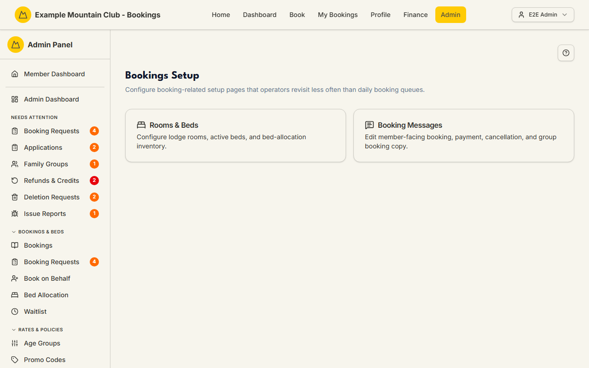

# Bookings Setup

Audience: Operator

## What it is

A small hub that gathers the booking-related setup pages you revisit less often
than the daily booking queues. It links to two places: **Rooms & Beds** (the bed
inventory) and **Booking Messages** (member-facing booking copy), and carries one
settings card of its own: **Member guests** (the member-guest consent policy,
#2307). Find it at **Admin → Setup & Configuration → Bookings Setup**
(`/admin/bookings-setup`).

Which cards you see depends on your permissions and the active modules — the
Rooms & Beds card follows the `bedAllocation` module.

## When you'd use it

- You are setting up (or adjusting) the lodge's rooms and beds.
- You want to edit the wording members see during booking and payment.
- You are configuring the **Member guests** policy — whether the other member is
  asked first, how long a consent request waits, and whether members can find
  each other by name.
- You are looking for the less-frequent booking configuration pages in one
  place.

## Step-by-step

### Open the hub and pick a card

1. Go to **Admin → Setup & Configuration → Bookings Setup**.

   

2. Choose a card:
   - **Rooms & Beds** (`/admin/rooms-beds`) — configure lodge rooms, active
     beds, and the bed-allocation inventory. (When the `bedAllocation` module is
     on, a lodge's capacity is its active bed count.)
   - **Booking Messages** (`/admin/booking-messages`) — edit the member-facing
     booking, payment, cancellation, and group-booking copy. See the
     [Booking Messages](booking-messages.md) guide.

### The Member guests card (#2307)

Below the hub cards sits the **Member guests** settings card. It controls the
"+ Add Member Guest" feature (the `memberGuests` module):

1. **Does the other member have to agree first?** — *Ask them first* (the
   default: the member is emailed and a bed is held until they answer) or *Just
   tell them* (the guest is added straight away and the member is emailed to say
   so; they can still take themselves off).
2. **How long to wait for an answer** — 1 to 60 days (default 7). After this the
   request lapses on its own, the bed is released, and the person who made the
   booking is told. A request never outlives the stay: it always lapses at least
   a day before check-in.
3. **Finding the other member** — two privacy toggles, both off by default.
   *Let members search by name* makes your membership list browsable to any
   member; *Include under-18s in name search* extends that to children. Each
   carries its warning on the card. Per owner decision D-18 these two settings
   **never travel in club config transfer**; the module switch, the ask-first
   choice and the waiting period do.

   Both toggles are **live from #2308** — they take effect the moment you save,
   with no deploy in between. (They shipped one release earlier saved but read by
   nothing, and the card said so at the time; that notice has come out now that
   they do something.)

### What "Let members search by name" really costs

Read this before you turn it on. It is written plainly rather than reassuringly,
because the setting does exactly what it says.

**With open member search ON, your club's member name list is deliberately
browsable by any member who can start a booking.** A member can type "a", then
"b", then "c", and page through most of the roll. That is not a side effect —
it is the whole purpose of the setting, and it is why it ships off and is a
per-club choice.

What we do keep in place around it:

1. **A speed limit.** A burst cap and a real daily cap, counted against the
   member who typed rather than against their internet address, so switching
   phone or network gains nothing.
2. **A record.** Every single search is written to the audit log with the member's
   name and what they typed, so probing is detectable after the fact. **This
   means anyone who can read your audit log will see the names and email
   addresses members typed into the finder.**
3. **Ten results at a time, matching only from the start of a name.** Typing
   "sm" matches Smith and Smart but never Blacksmith, and you are never told how
   many were hidden — a count would quietly tell every member how big the club
   is. Harvesting the roll is therefore slow and noisy rather than one request.
4. **Under-18s left out**, unless you separately opt them in.

**None of those make the list unbrowsable.** If your club has not agreed to
members being able to look each other up by name, leave the switch off — the
default finder needs the other member's exact email address, which a member
either has or has to go and ask for.

### What a member sees when they add somebody

With the module on, the booking wizard's Guests step gains a **+ Add Member
Guest** button beside the existing "+ Add Non-Member Guest". It opens a find box
**inline, underneath the Guests heading** — not a pop-up.

- **One box takes either.** If what the member types looks like an email address
  we look that address up exactly; otherwise, and only if you turned name search
  on, we search names.
- **A found member's full name and age group show straight away**, before they
  have agreed. Nothing else about them is ever shown — no email, no town, no
  photo, no membership type.
- **Several people at one address** (a household sharing an email) produce a
  short pick-list. Two members with the same name and age group look identical
  on purpose; the box points the booker at the email address rather than
  inventing a distinguishing detail they never had.
- **When somebody cannot be added**, the member gets one sentence — "This member
  can't be added to this booking right now." — and the same sentence whatever the
  real reason. See below.

### Why refusals are deliberately unhelpful, and what backs that up

A member is never told *why* another member could not be added: whether their
subscription is unpaid, their profile incomplete, or they are already booked
those nights. One informative refusal would let anybody map another member's
movements and finances by trying date after date.

From #2388, three things back that wording up:

- **A per-person speed limit on adding**, counted only when the person being
  added is outside the booker's own family. An ordinary family booking is never
  slowed by it, however many times the dates change.
- **Equal timing.** The "no such member" answer used to come back noticeably
  faster than the others; it no longer does.
- **A record an admin can read.** Repeated refusals against the same person raise
  a flagged entry in the audit log naming both members. **Nothing is ever blocked
  automatically** — a member trying several dates to find one that suits a friend
  is the normal case, and that is indistinguishable from probing without a human
  looking. If you see one of these entries, treat it as a conversation to have,
  not a rule that fired.

Being honest about the limit: a patient member who stays inside the daily cap can
still work out which nights another member is booked. That residual is known,
deliberate, and now recorded rather than invisible.

The card stays editable while the `memberGuests` module is off — a banner says
nothing is in use yet, so you can configure the policy first and then turn the
module on under **Admin → Modules**. With bookings *view* access (not edit) the
card renders read-only with a banner saying so; there is never a Save button
that would be refused.

## Settings reference

Apart from the Member guests card, this page is a launcher, not a settings
screen.

| Card | Goes to | What it configures | Gating |
| --- | --- | --- | --- |
| Rooms & Beds | `/admin/rooms-beds` | Lodge rooms, active beds, bed-allocation inventory | Follows the `bedAllocation` module |
| Booking Messages | `/admin/booking-messages` | Member-facing booking/payment/cancellation/group copy | Support permission area |
| Member guests (card on this page) | — | Ask-first vs tell, consent waiting period, name-search privacy toggles | Bookings permission area (view = read-only) |

If no cards are available, the page shows "No setup pages are available for your
current permissions."

## Troubleshooting

| Symptom | Likely cause | Fix |
| --- | --- | --- |
| "No setup pages are available for your current permissions" | Your role lacks access to both linked pages | Ask a full admin for the relevant access |
| The Rooms & Beds card is missing | The `bedAllocation` module is off | Enable it under **Admin → Setup → Modules** — see [`CONFIGURATION.md`](../../CONFIGURATION.md#module-controls-and-admin-modules) |

## Related links

- Back to the [documentation hub](../README.md).
- Sibling guides: [Booking Messages](booking-messages.md),
  [Bed Allocation](bed-allocation.md), [Bookings](bookings.md).
- Reference: [lodge settings](../../CONFIGURATION.md#lodge-settings) and the
  [capacity model](../CAPACITY_MODEL.md#two-distinct-quantities).
