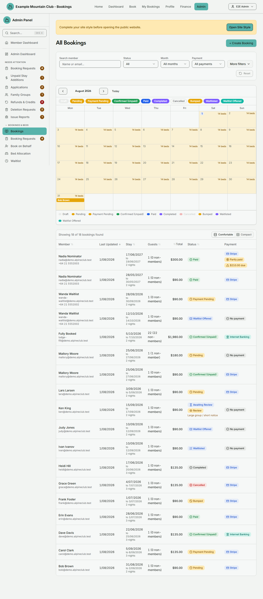

# Bookings

Audience: Operator

## What it is

The master list of every booking the club holds — past, present, draft, and
cancelled — with a filter bar, an availability calendar, and a sortable table.
This is where an operator looks up a member's stay, checks who is booked on a
given night, spots bookings that still need review, and opens any booking to
manage it. Find it at **Admin → Bookings & Beds → Bookings**
(`/admin/bookings`).

Money is shown in dollars but stored as integer cents; every date is an NZ
date-only lodge night (no times), matching the rules in
[`DOMAIN_INVARIANTS.md`](../DOMAIN_INVARIANTS.md#money).

## When you'd use it

- A member calls to ask about their booking and you need to find it by name or
  email.
- You want to see how full a night or week is before confirming a new booking.
- A booking is flagged **Review** (for example minors booked without an adult)
  and you need to jump to the approvals queue.
- You are chasing unpaid stays, cancelled bookings, or bookings whose Xero
  invoice is missing.
- You want to start a new booking on a member's behalf (the **+ Create
  Booking** button).

## Step-by-step

### Open the bookings list

1. Go to **Admin → Bookings & Beds → Bookings**. The page loads titled **All
   Bookings** with the filter bar, the availability calendar, and the results
   table below it.

   

2. The calendar shows the month with each night's remaining beds (for example
   "14 beds") and coloured bars for the bookings on those nights. The colour
   legend under the calendar maps each colour to a booking status.

### Find a specific booking

1. Type a name or email into **Search member**. The list filters as you type
   (there is a short debounce, so pause briefly).
2. Narrow further with **Status**, **Month**, or **Payment** if needed.
3. Click the member's name in a row to open their member record, or the status
   chip to open the booking detail page.

### Filter the list

1. Use the always-visible filters for the common cases:
   - **Status** — All, or a single booking status (Pending, Confirmed
     (Unpaid), Paid, Waitlisted, Cancelled, and so on).
   - **Month** — All months, or a specific month such as "Jul 2026".
   - **Payment** — All payments, Stripe, Internet Banking, or No payment.
2. Click **More filters** for the advanced set (Deleted, Xero invoice state,
   Beds allocation state, Changes, Additional Payment, and three date ranges —
   Updated, Check In, Check Out). Active filters appear as removable chips, and
   the whole filter state is stored in the page URL so a filtered view can be
   bookmarked or shared.
3. Click **Clear** to reset every filter.

### Read the results table

1. The toolbar shows "Showing N of M bookings found". Sort any sortable column
   (Member, Last Updated, Stay, Guests, Total, Status) by clicking its header.
2. Each row shows the member, the stay dates and nights, the guest count
   (total and how many are non-members), the price, the status chip, and the
   payment method. A **Review** chip on the Status cell links straight to the
   Approvals queue for that booking.

### Start a booking on a member's behalf

1. Click **+ Create Booking** (top right) to open the
   [Book on Behalf](book.md) wizard. If your admin role is view-only for
   bookings, this button is disabled.

### Turn off all emails for one booking

Sometimes you are already dealing with a member directly — over the phone, in
person, or by a long email thread — and the club's automatic messages would
only confuse things. The **No emails** switch on a single booking stops the
system sending that member *anything* about it.

> **This is a promise you make, not one the system keeps.** Nothing withheld is
> ever sent later. If you turn the switch on and the booking is then cancelled,
> the member is never told about the cancellation by the club. Telling them is
> your job from that moment on.

1. Open the booking (click the status chip on its row in the table above).
2. In the **Admin tools** card, click **Turn off all emails**.
3. Read the dialog. It states the consequence plainly: no emails at all for
   this booking, including cancellation notices and payment reminders. Two
   extra warnings appear when they apply:
   - **the booking is holding a live waitlist offer.** The member was already
     emailed that offer and **can still accept it**, so do not reassign the
     bed. What they lose is the expiry warning and the confirmation if they
     do accept — so follow it up yourself.
   - **the booking is still waitlisted** (no offer made yet). While emails are
     off it is skipped when beds are handed out, so no offer is made at all.
     It keeps its place in the queue and holds nobody else up. Nothing about
     this appears in the withheld list later, because there is no offer to
     withhold — this dialog is the only place you are told.
4. Click **Yes — I will tell the member myself**. Nothing is saved until you
   do; **Cancel** leaves the booking exactly as it was.

While the switch is on:

- the booking shows a **red banner** listing what was actually withheld,
  grouped by kind with a count (so a week of chore-roster emails is one line
  reading "Chore Roster ×56" rather than 56 lines burying the cancellation
  underneath). Work down that list when you contact the member. Two kinds carry
  a link rather than information, and they need different things from you:
  the **split-guest payment link** was never generated at all, so clearing the
  switch is enough — it is re-sent automatically. The **chore roster** is not
  the same: the guest's old chore link was replaced before the email was
  withheld, so it no longer works, and nothing re-sends the new one. Clear the
  switch, then re-send the roster from the Roster page by hand;
- the banner also points at **Admin → Email deliverability**. The list covers
  messages the system *deliberately* withheld; a message that failed for some
  other reason shows up there instead, so check both before telling a member
  you have the full picture;
- every action that would normally ask "email the member about this?" stops
  asking and tells you emails are off instead;
- **account and security email is not affected.** Two-factor codes, password
  resets, magic-link sign-ins and email-change notices all still work. The
  switch is attached to the booking, never to the member's address;
- **admin alerts still reach you.** Payment failures, capacity warnings and the
  rest are unaffected;
- **the Xero invoice email is withheld too.** The invoice itself is still
  created in Xero and is unchanged — only the emailing stops, so send it from
  Xero by hand if the member needs it.

To undo it, click **Turn emails back on**. That takes no acknowledgement (a
stuck switch must always be clearable), but it does **not** re-send anything
that was withheld — which is why the banner keeps listing what was missed. It
stays on the booking after the switch is cleared, turning **amber** instead of
red: the messages are still ones the member never received.

Both turning it on and turning it off are written to the
[Audit Log](audit-log.md), with who did it and when.

## Settings reference

The bookings list is a working queue, not a settings page. The controls below
are its filters and columns.

| Control | What it does | Default | Notes / constraints |
| --- | --- | --- | --- |
| Search member | Free-text match on member name or email | empty | Debounced; resets to page 1 |
| Status | Filter to one booking status | All | Values map to the booking state machine (see below) |
| Month | Filter to a single month | All months | Options span the current year ±1 |
| Payment | Filter by payment method | All payments | Stripe, Internet Banking, or No payment |
| More filters → Deleted | Show/hide soft-deleted bookings | Hide deleted | Include deleted or Deleted only |
| More filters → Xero | Filter by Xero invoice state | All Xero states | Invoice linked/missing, failed/partial/pending activity |
| More filters → Beds | Filter by bed-allocation state | All bed states | Only shown when the `bedAllocation` module is on |
| More filters → Changes | Filter by change/review state | All change states | Requires review, pending request, has modification, credit generated |
| More filters → Additional Payment | Bookings that still owe extra | All | "Still owing" |
| Updated / Check In / Check Out ranges | Date-range filters | empty | NZ date-only |
| Lodge | Filter by lodge | All lodges | Only shown when more than one active lodge exists |
| + Create Booking | Open the Book on Behalf wizard | — | Disabled for view-only bookings roles |

**Booking status chips** (shared with the rest of the app): Draft, Pending,
Payment Pending, Confirmed (Unpaid), Awaiting Review, Paid, Completed,
Cancelled, Bumped, Waitlisted, Waitlist Offered. The full set of transitions
lives in [`STATE_MACHINES.md`](../STATE_MACHINES.md#booking-lifecycle).

## Troubleshooting

| Symptom | Likely cause | Fix |
| --- | --- | --- |
| No bookings show | Filters are too narrow, or you are viewing the wrong month | Click **Clear**, then re-apply one filter at a time |
| A booking you expect is missing | It may be soft-deleted or in another lodge | Under **More filters** set Deleted to "Include deleted", and (multi-lodge) check the Lodge filter |
| A row shows a **Review** chip | The booking needs admin review (for example a minor without an adult) | Click the chip to open the [Booking Requests → Approvals](booking-requests.md) queue |
| The Beds filter is missing | The bed-allocation module is off | Enable it under **Admin → Setup → Modules** (`bedAllocation`) — see [`CONFIGURATION.md`](../../CONFIGURATION.md#module-controls-and-admin-modules) |
| **+ Create Booking** is greyed out | Your admin role can view bookings but not edit them | Ask a full admin to grant bookings edit access |
| A member says they never got a confirmation, reminder, or cancellation notice | The booking may have the **No emails** switch on | Open the booking; if the withheld-emails banner is there — **red** while emails are off, **amber** once they are back on — it lists exactly what was held back. Relay it, and check **Admin → Email deliverability** too for messages that failed for other reasons |
| **Turn off all emails** is greyed out | Your admin role can view bookings but not edit them | Ask a full admin to grant bookings edit access |
| A booking still shows the withheld-emails warning after emails were turned back on | Correct — turning the switch back on never re-sends anything | The banner is the record of what the member was never told; work through it with them |

## Related links

- Back to the [documentation hub](../README.md).
- Sibling guides: [Book on Behalf](book.md), [Booking Requests](booking-requests.md),
  [Bed Allocation](bed-allocation.md), [Waitlist](waitlist.md),
  [Payments](payments.md).
- Reference: the booking state machine in
  [`STATE_MACHINES.md`](../STATE_MACHINES.md#booking-lifecycle), the
  booking/payment flow in
  [`ARCHITECTURE.md`](../ARCHITECTURE.md#booking-and-payment-flow), and the
  status list in [`ARCHITECTURE.md`](../ARCHITECTURE.md#booking-statuses).
