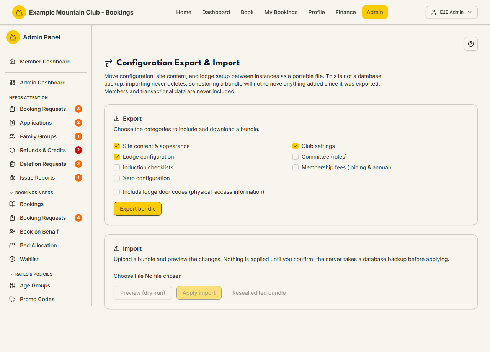

# Export & Import (config transfer)

Audience: Operator

## What it is

A full-admin tool that exports your club's **configuration, site content, and
lodge setup** as a single portable `.zip` bundle, and imports such a bundle into
another (or the same) instance through a **preview → apply** flow that never
deletes. Find it at **Admin → Setup & Configuration → Export & Import**
(`/admin/config-transfer`).

Only **Full Admins** can open this page (others see a "full administrators only"
notice). It is **not** a database backup: importing never removes anything added
since the export, and members, bookings, payments, and other transactional data
are never included. The full contract — categories, validation rules, and safety
model — lives in the [config-transfer feature hub](../config-transfer/README.md).

## When you'd use it

- Cloning a configured club into a new environment (staging → production, or a
  fresh fork).
- Moving site content, lodge setup, or fee schedules between instances without
  re-entering them by hand.
- Taking a portable, human-editable snapshot of configuration to review or edit.

## Step-by-step

### Export a bundle

1. Go to **Admin → Setup & Configuration → Export & Import**.

   

2. In **Export**, tick the categories to include. **Include lodge door codes** is
   an opt-in checkbox (physical-access information), off by default.
3. Click **Export bundle** to download `config-transfer-<date>.zip`.

### Import a bundle

1. In **Import**, choose a `.zip` file and click **Preview (dry-run)** — nothing
   is written yet. The plan shows, per entity, what would be **New**, **Updated**,
   or **Unchanged**, plus any door-code, Xero-org, or edited-bundle warnings.
2. Pick a **write mode** — **Merge** (recommended; only fields with a value in
   the bundle are written) or **Overwrite** (the bundle fully defines each
   record; blank fields clear it). You can also untick categories or resolve a
   rename via its match picker; each change re-previews.
3. If validation shows **errors**, Apply stays disabled — fix the bundle, use
   **Reseal edited bundle** to regenerate its manifest, and re-preview. When the
   plan is clean, click **Apply import**: the server takes a `pg_dump` backup
   first, then applies in one transaction.

## Settings reference

Exportable categories:

| Category | Contains |
| --- | --- |
| Site content & appearance | CMS pages, keyed site content, club theme (embedded images travel in the bundle) |
| Club settings | Club-wide singletons: modules, booking defaults, member fields, club identity, email message settings, etc. |
| Lodge configuration | Lodges, rooms, beds, seasons, season rates, lodge instructions, chore templates |
| Committee (roles) | `CommitteeRole` definitions only (not member-linked assignments) |
| Induction checklists | Induction templates with their sections and items |
| Membership fees (joining & annual) | Joining-fee and annual-fee schedules with invoice-line components (integer cents) |
| Xero configuration | Xero account and item-code mappings |

| Control | Effect |
| --- | --- |
| Include lodge door codes | Opt-in; adds physical-access door codes to the export |
| Write mode: Merge / Overwrite | Merge patches only bundled fields; Overwrite makes the bundle authoritative (blank clears) |
| Categories to import | Untick to import a subset (re-previews) |
| Match picker | Resolve an unmatched season/chore/induction template as *create new* or *match existing* |
| Reseal edited bundle | Regenerate the manifest after hand-editing a bundle |

Import **never deletes**; the automatic pre-apply `pg_dump` backup is the true
rollback. Validation errors (bad dates, non-integer money, invalid slugs, unknown
keys) **block** apply until fixed.

## Troubleshooting

| Symptom | Likely cause | Fix |
| --- | --- | --- |
| "available to full administrators only" | You aren't a Full Admin | Ask a Full Admin to run the transfer |
| Apply is disabled | The plan has validation errors | Fix the named rows, **Reseal**, and re-preview |
| "This bundle was edited since export" warning | Manifest checksums don't match the files | Advisory only — apply anyway, or **Reseal** to refresh the manifest |
| Xero org mismatch warning | The Xero config came from a different connected org | Verify the codes, or untick the Xero category before applying |
| A door-code change warning appears | The bundle would set/change a lodge door code | Confirm it's intended before applying |
| A "restore" didn't remove stale rows | Import never deletes | Remove them on the owning admin page; the backup is the true rollback |

## Related links

- Back to the [documentation hub](../README.md).
- Feature hub: [Configuration Export & Import](../config-transfer/README.md).
- Sibling guides: [Setup](setup.md), [Modules](modules.md),
  [Site Content](site-content.md), [Xero Sync](xero.md).
- Reference: the pre-apply backup and DR flow in [`DEPLOYMENT.md`](../../DEPLOYMENT.md).
