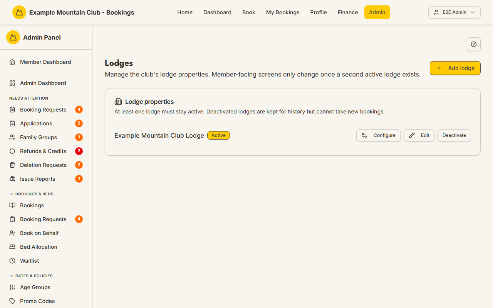

# Lodges

Audience: Operator

## What it is

The list of the club's lodge **properties**: their names, whether each is active,
and the address/door-code/travel-note that feed booking emails and the public
site. From here you add a lodge, edit its identity, deactivate it, or open its
**configuration hub** (rooms/beds, lockers, seasons & rates, and chores as cards,
plus per-lodge display settings as a section when the `lobbyDisplay` module is on).
Find it at **Admin → Setup & Configuration → Lodges** (`/admin/lodges`).

Lodges are a **lodge** permission area: lodge view to read, lodge **edit** to add,
edit, or deactivate. Member-facing screens only change once a **second active
lodge** exists — a single-lodge club sees no lodge pickers.

The same page also carries an **Other lodges** panel — a separate registry of
*other clubs'* lodges the club recognises (name, location, booking officer
contact, and bed capacity). These are **not** the club's own lodges: they take no
bookings and have no configuration hub. Their names populate an **"Are you a
member of another lodge?"** drop-down on the public
[booking request form](booking-requests.md) (it defaults to **No**); the chosen
lodge is saved with the request for use when it is reviewed. The panel uses the
same **lodge edit** permission as the properties above.

## When you'd use it

- You are bringing a second lodge online and need to create and configure it.
- A lodge's address, door code, or travel note changed.
- A property is closing for the season and you want to stop new bookings against
  it.

## Step-by-step

### Review the lodge properties

1. Go to **Admin → Setup & Configuration → Lodges**. Each lodge shows its name, an
   **Active/Inactive** badge, and its travel note, with **Configure**, **Edit**,
   and **Deactivate/Activate** actions.

   

### Add a lodge

1. Click **Add lodge**, enter a name, and save. A new lodge lands straight in a
   guided **setup wizard** (`/admin/lodges/[id]/setup`) with identity pre-filled;
   every remaining step can be skipped and completed later.
2. **A new lodge is not open for booking.** It is created **Inactive**, and the
   last step of that guided setup is where you activate it. Until you do,
   nothing about it reaches a member: it is offered on no booking screen, in no
   lodge picker, and the member-facing screens carry on as though the club had
   one lodge. That is deliberate — a lodge with no rooms, no beds and no rates
   used to be bookable the instant it was named.
3. You can still build the lodge out in full while it is closed: rooms, beds,
   lockers, seasons, rates, chores and its capacity override all work on an
   inactive lodge, and so does copying seasons or chores from an existing one.
   Activation is the last thing you do, not the first.

   The five full editors the setup flow links to — **Rooms & Beds**,
   **Lockers**, **Seasons**, **Fees** and **Chores** — are the exception to the
   picker rule in the next point. Follow one of those links and the page stays
   on the lodge you came from, with its name shown in the lodge picker followed
   by **(closed)**, so you can see which building you are filling in. Reaching
   the same page from the menu instead still starts you on a lodge that is open.
4. Leaving it closed is a legitimate answer. A lodge the club has bought but not
   opened stays Inactive for as long as you like; the setup checklist reports it
   as outstanding rather than nagging you to open it.

### Edit a lodge's identity

1. Click **Edit** on a lodge and set its **Name**, **Address**, **Door code**, and
   **Travel note**, then **Save**. The address feeds the public
   `{{lodge-address}}` content token; the door code and travel note appear in that
   lodge's booking and pre-arrival emails.

### Configure a lodge

1. Click **Configure** to open the lodge's hub (`/admin/lodges/[id]`), which cards
   through to [Rooms & Beds](rooms-beds.md), [Lockers](lockers.md), Seasons &
   Rates (in [Fees](fees.md)), and [Chores](chores.md). The **per-lodge display
   settings** are **not** a hub card — they appear as a separate section on this
   page only when the `lobbyDisplay` module is on (it is **off by default**; enable
   it under **Admin → Setup → Modules**). See [Lobby Display](display.md).

### Deactivate a lodge

1. Click **Deactivate**. If the lodge still has future bookings, waitlist entries,
   hut-leader assignments, or bound kiosk accounts, a pre-flight lists them and
   asks you to confirm — deactivating stops new bookings but leaves those in place.
   At least one lodge must stay active.

### Manage other lodges

1. Scroll to the **Other lodges** panel below the lodge properties. Click **Add
   other lodge**, enter at least a **Name** (the only required field), optionally
   fill in **Location**, the **booking officer's** name/email/phone, and a
   **Bed capacity**, then **Save**.
2. Use **Edit** to change a lodge, or **Delete** to remove it from the list.
   Names must be unique — a duplicate is rejected with a clear message.

## Settings reference

### Lodge properties

| Field | What it controls | Default | Notes / constraints |
| --- | --- | --- | --- |
| Name | The lodge's display name | — | Required; up to 120 characters |
| Address | The property address | — | Optional; feeds the public `{{lodge-address}}` token (up to 300 chars) |
| Door code | The lodge access code | — | Optional; appears in that lodge's booking/pre-arrival emails (up to 80 chars) |
| Travel note | Directions / arrival notes | — | Optional; appears in booking/pre-arrival emails (up to 2000 chars) |
| Active | Whether the lodge takes new bookings | **off for a new lodge** | A lodge you add is created inactive and is activated on the last step of its guided setup. At least one lodge must stay active; inactive lodges are kept for history |
| Configure | Opens the per-lodge configuration hub | — | Hub cards: rooms/beds, lockers, seasons & rates, chores. Per-lodge display is a separate section, shown only when the `lobbyDisplay` module is on (off by default) |

### Other lodges

| Field | What it controls | Default | Notes / constraints |
| --- | --- | --- | --- |
| Name | The other lodge's display name | — | Required; unique; up to 120 characters |
| Location | Where the other lodge is | — | Optional; up to 300 characters |
| Booking officer's name | Contact person at the other lodge | — | Optional; up to 200 characters |
| Booking officer's email | Contact email | — | Optional; must be a valid email; up to 320 characters |
| Booking officer's phone | Contact phone | — | Optional; up to 50 characters |
| Bed capacity | Informational bed count of the other lodge | — | Optional; whole number ≥ 0. Not this system's booking capacity |

The names recorded here are what the public booking-request form offers under
*"Are you a member of another lodge?"*, and what a booking officer picks from
when charging a visiting club's members at your member rate — see
[Bookings → Charge a visiting club's members at your member rate](bookings.md#charge-a-visiting-clubs-members-at-your-member-rate).
A lodge that a booking or a request already names cannot be deleted.

## Troubleshooting

| Symptom | Likely cause | Fix |
| --- | --- | --- |
| Everything is read-only ("… can view the lodge properties but cannot change them") | Your admin role has lodge view but not edit | Ask a full admin for **lodge edit** access |
| Deactivate warns about dependencies | The lodge still has future bookings, waitlist, hut-leader, or kiosk ties | Review the list; confirm to deactivate anyway (they stay in place) or resolve them first |
| "At least one lodge must stay active" | You tried to deactivate the only active lodge | Keep one active, or activate another first |
| Member screens don't show a lodge picker | The club has only one active lodge | Expected — pickers appear once a second active lodge exists. A second lodge you have added but not yet activated does not count, which is why the pickers appear when you open it rather than when you name it. Rooms & Beds, Lockers, Seasons, Fees and Chores are the deliberate exception: they show a closed lodge too, labelled **(closed)**, because they are where you configure one |
| A new lodge is not offered for booking | It is inactive, which is how every new lodge starts | Open its guided setup (`/admin/lodges/[id]/setup`) and activate it on the last step, or use **Activate** on this page |
| Door code/travel note isn't in an email | The lodge's field is blank, or the email template omits the token | Fill the field here; check the [Booking Messages](booking-messages.md)/email template |

## Related links

- Back to the [documentation hub](../README.md).
- Feature hub: [Multi-lodge support](../multi-lodge/README.md)
  ([feature overview](../multi-lodge/feature-overview.md)).
- Sibling guides: [Rooms & Beds](rooms-beds.md), [Lockers](lockers.md),
  [Chores](chores.md), [Lodge Kiosk](lodge.md).
- Reference: [Adding a Second Lodge](../../CONFIGURATION.md#adding-a-second-lodge)
  and [Admin and Lodge](../ARCHITECTURE.md#admin-and-lodge).
