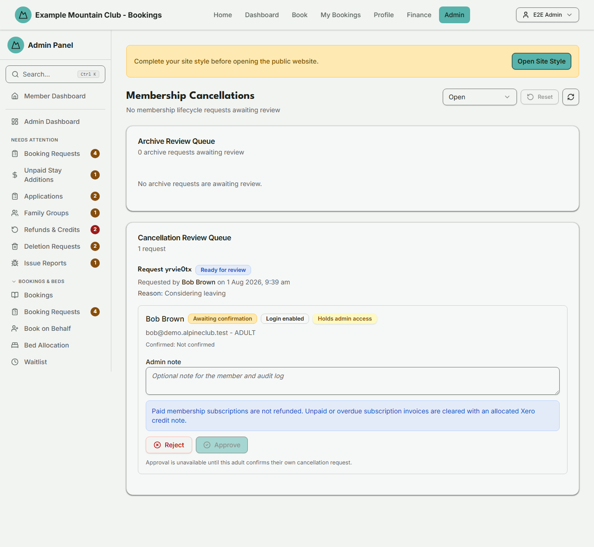
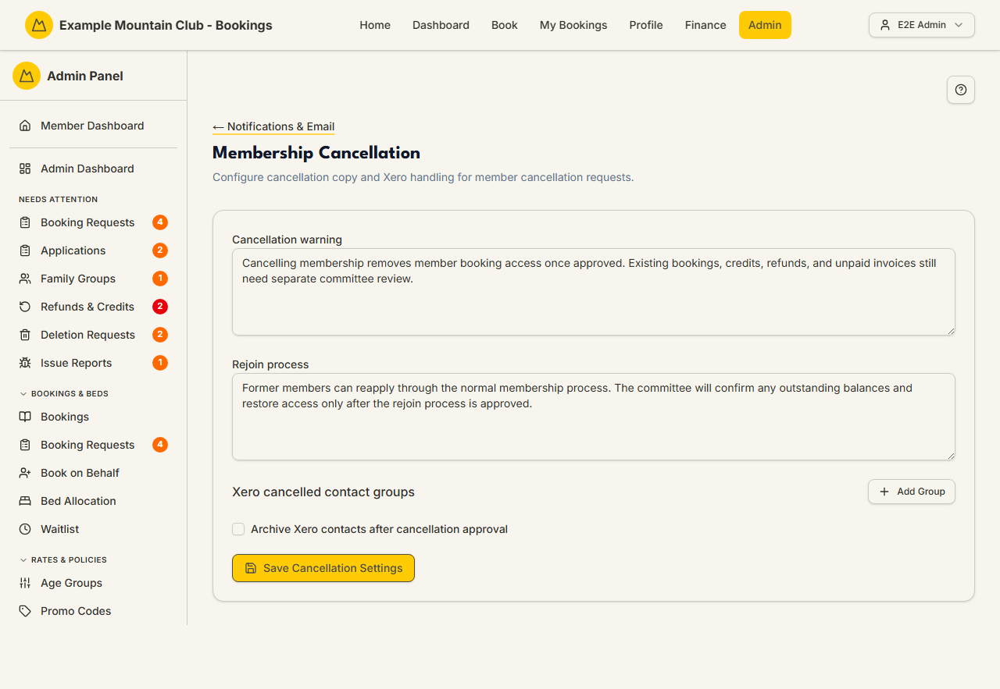

# Cancellation Requests

Audience: Operator

## What it is

The review queue for members leaving the club: **membership cancellation
requests** (approve or reject per person, with a member-email choice) and
**member archive requests** (approve or reject, with a two-admin rule). Find it at
**Admin → Members → Cancellation Requests** (`/admin/membership-cancellations`).
It also appears under **Needs Attention** while requests are pending.

The member-facing wording and the Xero contact-group handling behind these
requests are edited on a separate **Membership Cancellation** settings page —
covered in [its own section below](#cancellation-copy-and-xero-settings).

Cancellations are a **membership** permission area: membership view to read the
queues, membership **edit** to approve or reject. Paid subscriptions are never
refunded here; unpaid or overdue subscription invoices are cleared with an
allocated Xero credit note.

## When you'd use it

- A member has requested to cancel their membership and you need to review it.
- You need to cancel a membership on a member's behalf — for example someone
  who rang the club, or a member with no login of their own (most family
  dependants). Open their member page and use **Request Cancellation**: the
  request is confirmed on their behalf and lands in the queue below for a
  normal approval decision. This works for anyone who holds a membership,
  including a member who is also an admin and including a school or
  organisation account; you no longer have to strip an admin's access first.
  See [who can be cancelled](../CANCELLATIONS.md#who-can-be-cancelled) for the
  two record types that are not offered the action, and for the two rules that
  govern approving a cancellation for an account with admin access.
- A member has started their own cancellation from the **Membership
  Cancellation** panel in their profile. That panel now follows the same rule as
  the member page, so requests can arrive from an admin cancelling their own
  membership, or from an organisation account, and a relative's family list can
  include a spouse who is also an admin. It adds only two conditions of its own,
  both about being able to use your own profile: the account must be active and
  must have its own login. Whoever raised it, approval is still a separate
  decision by a *different* admin.
- An admin has requested to archive a member and a *different* admin must approve.
- You are auditing completed, rejected, or withdrawn lifecycle requests.

## Step-by-step

### Review the queues

1. Go to **Admin → Members → Cancellation Requests**. The page shows an **Archive
   Review Queue** and a **Cancellation Review Queue**, with a status filter (Open,
   Completed, Rejected, Withdrawn, All) and a **Refresh** button.

   

### Approve or reject a cancellation

1. In the **Cancellation Review Queue**, open a request and its participants. A
   participant can be approved once its status is *Ready for review* and the
   member has confirmed; if bookings are outstanding, or the member's Xero
   contact still has money owing, an amber notice lists them and says what to do
   — resolve those first. Each invoice in that notice is a link into Xero, and
   the notice also links straight to the Membership Cancellation settings page
   if the club would rather not archive Xero contacts at all. See
   [unpaid invoices block approval](../CANCELLATIONS.md#unpaid-invoices-block-approval)
   for what counts as owing and the ways to clear it.

   If your admin role can **view** membership but not edit it, the request
   carries a short blue note instead: *The money-owing check was not run for …
   member(s) below*, and each affected row is marked. Asking Xero what a contact
   owes uses one of the club's metered API calls, so the queue only spends one
   for an admin who could act on the answer. Read that note literally — it does
   not mean the member owes nothing, it means nobody asked. An admin who can
   approve sees the real answer on this same page. Outstanding **bookings** are
   still checked and still listed for you, so only the money side is missing.
2. Add an optional **Admin note** (sent to the member and the audit log). The blue
   notice reminds you: paid subscriptions are not refunded; unpaid/overdue
   subscription invoices are cleared with an allocated Xero credit note.
   A second blue notice appears beside a participant whose membership was billed
   on a **shared family invoice** that other members are still covered by. It
   says plainly that approving will raise **no** credit note, names who is
   staying, and links the invoice into Xero. It also tells you which of two
   things is about to happen, because it is not always the same one: either the
   approval simply goes through and leaves that invoice alone, or — when the
   invoice sits on this member's own Xero contact, which is the usual case for
   whoever the family is billed to — **the approval is refused over it**, because
   approving would archive a contact with a live balance behind it. The notice
   ends with the way forward for this particular family: approve the others
   first where that works, and where it cannot (the whole family shares one Xero
   contact, or the members holding the invoice open are deactivated rather than
   cancelled) it says so and points at Xero instead. If something is genuinely
   owed back to the leaver, raise that credit note in Xero yourself. See
   [shared family invoices](../CANCELLATIONS.md#shared-family-invoices).
3. Click **Approve** or **Reject**. A dialog asks whether to email the member —
   the request is processed either way and your choice is recorded in the audit
   log.
4. After an approval, an amber notice may appear listing **family links that
   were cleared**. Cancelling a member removes their parent links and any link
   pointing at them, so if the cancelled member sat in the middle of a family —
   someone's child *and* someone's parent — their own dependants are now left
   with no parent link recorded. They are deliberately not moved up to a
   grandparent: who is responsible for a member is a real-world fact, not
   something the system should decide for you. Link them under another parent if
   that is right for the family. The same notice lists anyone who was receiving
   club email at the cancelled member's address. Their email now goes to their
   own recorded address — which is often a COPY of the cancelled member's, and
   may be a placeholder that receives nothing, so check it. Both lists are also written
   to the audit log, so nothing is lost if you navigate away.

The same amber notice appears after approving an **archive** — archiving runs the
identical family-link sweep — and approving an **account deletion request** does
the same clean-up, additionally stopping club email being sent to the anonymised
address.

### Approve or reject an archive

1. In the **Archive Review Queue**, add an optional **Review note**, then click
   **Approve Archive** or **Reject**. If *you* raised the archive request, you
   cannot review it — a different admin must (this is enforced on the server too).

### Cancellation copy and Xero settings

The member-facing cancellation wording and Xero handling live on a separate
settings page — **Membership Cancellation** — reached from **Admin →
Notifications & Email** (`/admin/membership-cancellation`). It has no direct
sidebar entry and writes **membership** settings even though it sits under
Notifications.

There you can edit:

- **Cancellation warning** — the text shown to a member starting a cancellation.
- **Rejoin process** — the text explaining how a cancelled member can rejoin.
- **Xero cancelled contact groups** — the Xero contact groups that represent
  cancelled members (each a Group ID + optional Group name; **Add Group** /
  remove).
- **Archive Xero contacts after cancellation approval** — whether approving a
  cancellation also archives the member's Xero contact. While this is on,
  approval is refused for anyone whose Xero contact still has money owing, and
  refused too if Xero cannot be asked; with it off no contact is archived, so
  that check is not made at all.

Click **Save Cancellation Settings**. These settings are audited and do not call
Xero on save.

## Settings reference

The review queue itself has no persistent settings — only per-review inputs.

| Control | What it does | Notes / constraints |
| --- | --- | --- |
| Status filter | Open / Completed / Rejected / Withdrawn / All | Default is Open |
| Admin note / Review note | Note sent to the member and the audit log | Up to 1000 characters |
| Notify choice (approve/reject) | Whether the member is emailed | Processed either way; recorded in the audit log |
| Approve Archive | Archives the member | Two-admin rule: the requester cannot approve |

Settings on the **Membership Cancellation** page: Cancellation warning (text),
Rejoin process (text), Xero cancelled contact groups (Group ID + name rows;
empty-ID rows are dropped on save), and Archive Xero contacts after cancellation
approval (checkbox).

## Troubleshooting

| Symptom | Likely cause | Fix |
| --- | --- | --- |
| Everything is read-only ("… can view membership cancellations but cannot approve or reject them") | Your admin role has membership view but not edit | Ask a full admin for membership edit access |
| A participant can't be approved | Bookings are outstanding, or the member has not confirmed their own inclusion (member-raised requests only — an admin-raised one is already confirmed) | Resolve the listed bookings; wait for the member to confirm their request |
| A request says "The money-owing check was not run for … below" | Your admin role has membership view but not edit. Asking Xero what a contact owes costs one of the club's metered API calls, so the queue only spends one for an admin who could act on the answer — the same reason the Approve and Reject buttons are disabled for you | Nothing is wrong with the request. Read the note literally: it does **not** say the member owes nothing, it says nobody asked. Outstanding bookings are still checked and listed for you; only the Xero and shared-family-invoice answers are missing. Ask an admin with membership edit access — they see those on this same page. Approval itself always runs the check live, so nothing can slip through unchecked |
| **Approve** is greyed out on a *Ready for review* row, and the member is badged **Inactive** | The membership was deactivated or cancelled separately after the request was raised. The server refuses an approval in that state, so the button is disabled to match — and for the same reason its Xero and booking checks were not run | The line under the buttons says so. Either **Reject** the request, or reactivate the membership from the member's page first and then approve |
| **Approve** says Xero still shows money owing, and names the invoices | Approving archives the member's Xero contact, and an archived contact cannot be invoiced, credited or paid — so the club would be archiving an account it still needs. Most often an organisation or school account, which is usually the billing contact for its booking invoices. Drafts, voided and paid invoices are ignored; a part-allocated credit note leaves the remainder, which still counts | The amber notice beside the participant lists them, each one a link into Xero — including bills and any invoice Xero never numbered, which are linked to the contact instead. Open each and do one of: take the payment, raise a credit note and **allocate** it against the invoice, or **void** the invoice if nobody intends to collect it. Then approve again. The member's own *current*-season subscription invoice is normally not the cause — the cancellation credits that one itself — with two exceptions that are: a *next*-season invoice at a club that bills early, and a shared family invoice that other, staying members are also covered by, because that one is no longer credited automatically either (cancel the rest of the family first, or settle it in Xero). If the club does not want Xero contacts archived at all, use the **Open Membership Cancellation settings** link in that same notice and switch **Archive Xero contacts after cancellation approval** off; that lifts the check entirely, because the contact is then left alone |
| **Approve** says Xero is not connected, so its unpaid invoices could not be checked | Approving would archive the member's Xero contact, and the club's Xero authorisation is missing or no longer valid, so the check could not run. An unknown answer is treated as "there may be money owing", never as "nothing owing" | Reconnect Xero from **Admin → Xero**, then approve again. If the club is not using Xero archiving, switch **Archive Xero contacts after cancellation approval** off instead — with it off no contact is archived, so the check is not needed. This one will not clear by itself |
| **Approve** says Xero could not be reached, or that its API limit has been reached | Same check, but a temporary failure rather than a broken connection | Wait a few minutes and approve again. Nothing is lost — the request stays in the queue, and during a Xero outage the contact archive would have failed anyway. The API limit is the slower one: Xero's daily limit resets at midnight UTC, about midday here, so if the cancellation cannot wait that long, switch **Archive Xero contacts after cancellation approval** off instead |
| **Approve** says Xero refused the request for this member's contact | The Xero contact stored against the member no longer exists there — usually merged into another contact, or deleted. Waiting will not fix it, because the request itself is the problem | Open the member's page and re-link them to the right Xero contact, then approve again. Or switch **Archive Xero contacts after cancellation approval** off, since with it off there is no contact to archive and no check to run |
| **Approve** says the contact has more open invoices than the check can list | Genuinely unusual — a contact carrying hundreds of open invoices. The check reads a bounded number of them, so rather than report a partial answer as "nothing owing", it says it could not tell | Open the contact in Xero and settle or void what is outstanding, then approve again. Or switch **Archive Xero contacts after cancellation approval** off |
| A refusal ends "The review queue below could not be reloaded either, so it may be out of date" | Two things went wrong at once: the approval was refused, and the automatic refresh that follows a refusal also failed — usually a dropped connection or a restart between the two | Treat the list on screen as stale. Press the refresh button beside the status filter, or reload the page, before acting on anything below. The refusal itself still stands and its reason is the first part of the same message |
| A member says the **Membership Cancellation** panel in their profile refuses them | It is open to any account holder, including admins and organisation accounts, but it needs an active account with **its own login** — so a dependant or any other member without a login of their own cannot use it. The lodge kiosk login and booking-request contact records are refused too: they hold no membership | Include them in a family request raised by a relative, or open their member page and use **Request Cancellation** on their behalf |
| A member's page shows no **Request Cancellation** action | Their membership is already cancelled or archived, or is not active. Otherwise the record is not an account holder at all — the lodge kiosk account, or a booking-request contact (a public booking request's guest contact, or a school request's owner contact or teacher record). For a person, having no login does *not* hide it, and neither does holding admin access | Check the member's status first. If they are active and it is still missing, look at their **User Type**: "Lodge (kiosk account)" is the shared device login and has no membership — a real person who needs the kiosk should hold another role too — and a record created by a booking request is a contact, not a member |
| **Approve** on a cancellation says only a Full Admin can do it | The member holds a privileged access role (any admin, finance, lodge, or custom role), and only a Full Admin may approve a cancellation for such an account | Ask a full admin to approve it |
| **Approve** says this is the last Full Admin account | Approving would disable the login of the club's only remaining active Full Admin, leaving nobody able to administer the club | Give another active account Full Admin access first, then approve. This applies to an admin cancelling their own membership too — appoint your successor first |
| An admin cannot approve the cancellation they raised themselves | Cancellation approval always needs a different admin, including when an admin has raised it against their own membership | Ask another admin to review it |
| **Approve** says the admin who raised the request is no longer on file | That admin's record has since been deleted, so the club can no longer show the approval was a second pair of eyes | Reject the request and raise a new one; it can then be approved normally |
| Approve/Reject is disabled on an archive | You raised it — the two-admin rule needs a different reviewer | Ask another admin to review it |
| A refund didn't happen on cancellation | Paid subscriptions are not refunded; unpaid/overdue invoices are cleared with a credit note | This is by policy — see [`CANCELLATIONS.md`](../CANCELLATIONS.md#refund-policy) |
| No credit note was raised, and the blue notice said a shared invoice was involved | The member's membership was billed on one invoice covering a whole family or billing group, and other members it covers are staying. Crediting it would wipe their share of the bill too, so nothing is credited automatically | Nothing is wrong: the invoice stands and the club is still owed it by the members who remain. If money genuinely is due back to the leaver, open the invoice from the link in that notice and raise the credit note in Xero yourself. See [shared family invoices](../CANCELLATIONS.md#shared-family-invoices) |
| **Approve** is refused over the family's own subscription invoice | Approving would archive that member's Xero contact, and this cancellation will not credit that invoice because other members it covers are staying — so the balance is real and stays behind the archived contact | Read the blue notice beside the participant: it names the way out for this particular family, and there are three. Usually it is "approve the other family members first" — the last one approved credits the invoice in full and the refusal clears by itself. But where the whole family shares one Xero contact (children who inherit a parent's email address do), every one of them is refused over the same invoice and approving them in any order gets nowhere; and where the members holding it open were *deactivated* rather than cancelled, there is nothing to approve for them at all. In those two cases — and any time you would rather not wait — settle, credit or void the invoice in Xero, or switch **Archive Xero contacts after cancellation approval** off |
| No credit note was raised for the **last** member of a family to leave | Their season subscription was already **paid**, and paid subscriptions are never refunded automatically — so that last cancellation credited nothing either, and the family invoice keeps its balance | Nothing is broken and nothing is hidden: the club receives an admin alert naming that invoice, and the archive refusal keeps the Xero contact open behind it. Open the invoice in Xero and take the payment, credit it, or void it, whichever is right |

## Related links

- Back to the [documentation hub](../README.md).
- Sibling guides: [Members](members.md), [Subscriptions](subscriptions.md),
  [Refunds & Credits](refund-requests.md), [Deletion Requests](deletion-requests.md).
- Reference: the
  [membership cancellation, archive, and delete lifecycle](../STATE_MACHINES.md#membership-cancellation-archive-and-delete-lifecycle)
  and [refund and credit lifecycle](../STATE_MACHINES.md#refund-and-credit-lifecycle),
  the [refund policy](../CANCELLATIONS.md#refund-policy) and
  [GST treatment](../CANCELLATIONS.md#gst-treatment) in `CANCELLATIONS.md`, and
  the [Membership Cancellation Settings](../../CONFIGURATION.md#membership-cancellation-settings)
  reference.
