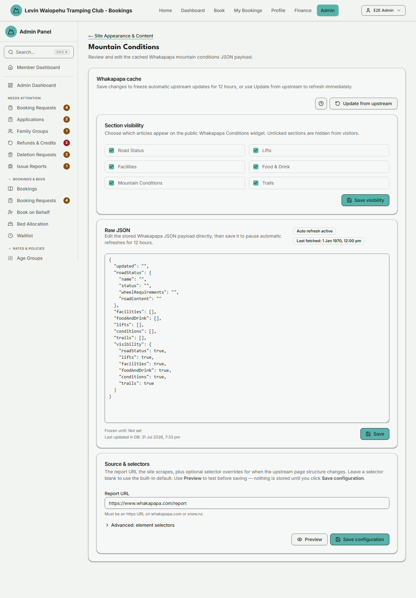

# Mountain Conditions

Audience: Operator

## What it is

The editor for the cached Whakapapa mountain-conditions payload that drives the
public Snow.nz conditions widget — road status, lifts, facilities, food & drink,
trails, and general conditions. Find it at **Admin → Setup & Configuration → Site
Appearance & Content → Mountain Conditions** (`/admin/mountain-conditions`). It
has no direct sidebar entry — open it from the **Mountain Conditions** card on
the Site Appearance & Content hub.

The page is gated by the **`skifieldConditions`** module (Admin → Modules),
which is on by default. Turning that module off hides both this page and the
public conditions widget. Mountain Conditions is edited under the **content**
permission area.

## When you'd use it

- The upstream Snow.nz feed is wrong or stale and you want to correct what
  visitors see.
- You want to hide a section (e.g. Lifts) from the public widget.
- You need to force a fresh pull from the upstream source.
- The upstream page structure changed and the scraper stopped picking up a
  section, so you need to point it at a new URL or adjust a selector.

## Step-by-step

### Refresh, curate, or edit the payload

1. Open **Mountain Conditions**. The **Whakapapa cache** panel shows the current
   state (**Auto refresh active**, **Last fetched**, **Frozen until**, **Last
   updated in DB**). Click **Update from upstream** to pull the latest feed
   immediately.

   

2. Under **Section visibility**, tick the articles that should appear on the
   public widget — **Road Status**, **Lifts**, **Facilities**, **Food & Drink**,
   **Mountain Conditions**, **Trails**. Unticked sections are hidden from
   visitors. Click **Save visibility**.
3. To edit the content directly, use the **Raw JSON** editor to change the stored
   payload (`roadStatus`, `lifts`, `facilities`, `foodAndDrink`, `conditions`,
   `trails`, and the `visibility` map), then click **Save**. **Saving freezes
   automatic upstream updates for 12 hours** so your edits are not overwritten.

   Each trail carries a `difficulty` of `Beginner`, `Intermediate`, `Advanced`,
   or `Expert`. On the public widget these render as the standard ski symbols —
   green circle (Beginner), blue square (Intermediate), black diamond
   (Advanced), red diamond (Expert) — with a matching key shown in the top-right
   of the Trails section.

### Point the scraper at a new URL or fix a selector

The upstream report is built with rotating style-name suffixes, so the scraper
matches on the stable parts of the page and does not need updating for a routine
upstream rebuild. When the page structure changes more deeply, use the
**Source & selectors** panel at the bottom of the page:

1. Set the **Report URL** the site scrapes. It must be an `https` URL on
   `whakapapa.com` or `snow.nz` — other hosts are rejected.
2. Under **Advanced: element selectors**, override individual selectors only if a
   section stops appearing. Leave a field blank to use the built-in default.
3. Click **Preview** to fetch and parse with the current URL and selectors
   **without saving** — the parsed result is shown so you can confirm the
   sections populate. When it looks right, click **Save configuration**. The URL
   and overrides are stored separately from the cached data, so an upstream
   refresh never wipes them.

### Share selectors between sites (import / export)

The built-in default selectors are **seeded into the database** (via migration),
so every site starts with the complete set already stored — the code defaults
are only a fallback for a brand-new, un-migrated database.

Under **Advanced: element selectors**:

- **Export selectors** reads the stored Report URL and the **full** selector set
  from the database and downloads them as a JSON file.
- **Import selectors** loads such a file and **saves it straight to the
  database**, so another site's admin does not have to re-enter the values by
  hand. An off-allowlist URL in the file is ignored (the current URL is kept);
  unknown fields are dropped.

Need an up-to-date file? Email the LWTC Admin at admin@lwtc.org.nz.

## Settings reference

| Setting | What it controls | Default | Notes / constraints |
| --- | --- | --- | --- |
| Update from upstream | Pulls the latest Snow.nz feed now | — | Refreshes immediately; does not freeze |
| Section visibility (Road Status / Lifts / Facilities / Food & Drink / Mountain Conditions / Trails) | Which articles show on the public widget | All on | Unticked sections are hidden from visitors |
| Raw JSON payload | The stored conditions content | Upstream feed | Must be valid JSON; saving freezes auto-refresh for 12 hours |
| Report URL | The page the scraper fetches | `https://www.whakapapa.com/report` | Must be https on whakapapa.com / snow.nz |
| Element selectors (Advanced) | Per-section overrides used to locate content on the source page | Built-in hash-agnostic defaults | Blank = use default; test with **Preview** before saving |
| Import / Export selectors (Advanced) | Transfer the URL + full selector set between sites as a JSON file | Defaults seeded into the DB | Export reads the DB; Import writes to the DB. Contact admin@lwtc.org.nz for a file |
| `skifieldConditions` module | Whether this page and the public widget exist at all | On | Toggled at **Admin → Modules**; off hides both |

## Troubleshooting

| Symptom | Likely cause | Fix |
| --- | --- | --- |
| The page 404s or the card is missing | The `skifieldConditions` module is off | Enable it at **Admin → Modules** |
| My edits were overwritten | Auto-refresh replaced them | Save via the Raw JSON editor — that freezes upstream updates for 12 hours |
| A section still shows publicly after unticking | Visibility wasn't saved | Click **Save visibility** after changing the checkboxes |
| A whole section is empty after an upstream change | The scraper can't locate it | Use **Preview** in **Source & selectors** to test, override the affected selector, then **Save configuration** |
| The report URL is rejected | It's not https or not on whakapapa.com / snow.nz | Enter an https URL on an allowed host |
| Save is rejected | The Raw JSON is malformed | Fix the JSON syntax and save again |
| Everything is read-only | Your admin role can view but not edit under the content area | Ask a full admin for content edit access |

## Related links

- Back to the [documentation hub](../README.md).
- Parent hub: [Site Appearance & Content](appearance.md).
- Sibling guides: [Site Banners](site-banners.md),
  [Page Content](page-content.md).
- Reference: the module switchboard in [Modules](modules.md).
