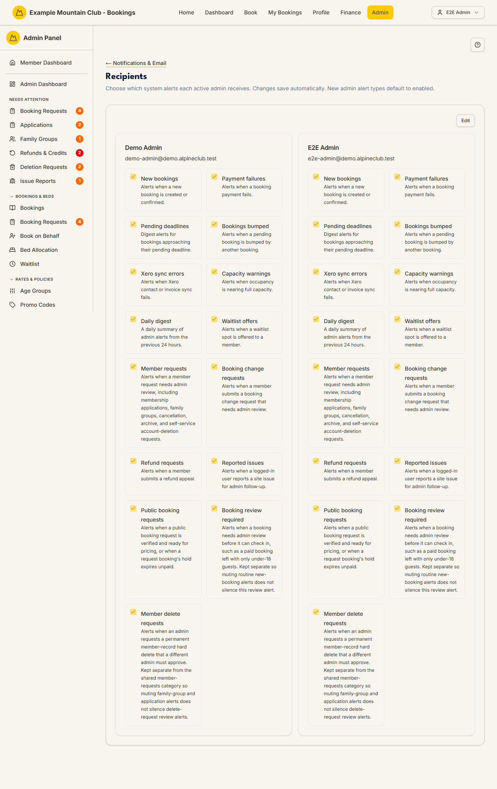

# Recipients

Audience: Operator

## What it is

A grid of your admin users, each with a set of checkboxes for the system
alerts they personally receive — new bookings, payment failures, refund
requests, Xero sync errors, the daily digest, and so on. It controls *who on the
team* is emailed when an alert fires, per admin. Find it at
**Admin → Setup & Configuration → Notifications & Email → Recipients**
(`/admin/notification-recipients`). It has no direct sidebar entry — open it from
the **Recipients** card on the Notifications & Email hub.

Every admin user is listed, not just Full Admins: Booking Officers, Membership
Officers, Treasurers and any custom access role your club has built all appear,
with their role name under their email address.

**Alerts follow the areas a role can edit.** Each alert belongs to one admin
area, and an admin is only offered — and only ever sent — the alerts for the
areas their access role can **edit**. A Booking Officer therefore starts with
the booking alerts switched on and sees the finance and membership ones greyed
out as *Not available*; a Treasurer gets the money alerts; a Full Admin can edit
every area, so they get everything, exactly as before. To widen someone's
alerts, widen their access role in [Access Roles](access-roles.md) — the
permission areas are the single source of truth for both what an admin can do
and what they are told about.

Recipients are edited under the **support** ("Support & System") permission
area: support **edit** can change them; a view-only support role sees the grid
but cannot edit. Within an admin's own areas, new alert types default to
**enabled**, so they receive everything for their areas until someone trims the
list.

Delivery Rules sit **upstream** of everything on this page. If
[Delivery Rules](notification-rules.md) mute a template club-wide, nobody
receives it however their boxes are ticked here.

## When you'd use it

- A committee member is being flooded with alerts they don't handle and wants
  some switched off.
- A new treasurer should start receiving payment-failure and Xero sync alerts.
- You want one person (not the whole team) to own the daily digest.

## Step-by-step

### Adjust who receives which alert

1. Open **Recipients**. Each admin user is a card of alert checkboxes; the
   alerts outside their areas are greyed out and cannot be ticked.

   

2. Click **Edit** to make the checkboxes editable. Tick or untick each alert for
   each admin.
3. Click **Save Changes** (or **Cancel** to discard). Only the admins you
   actually changed are written.

## Settings reference

Each admin card has one checkbox per alert type. The **Area** column is the
permission area an admin's role must be able to **edit** before that alert is
offered to them at all:

| Alert | Area | Sent when |
| --- | --- | --- |
| New bookings | Bookings | A new booking is created or confirmed |
| Payment failures | Finance | A booking payment fails |
| Pending deadlines | Bookings | Bookings approach their pending deadline (digest) |
| Bookings bumped | Bookings | A pending booking is bumped by another booking |
| Xero sync errors | Finance | Xero contact or invoice sync fails |
| Capacity warnings | Bookings | Occupancy is nearing full capacity |
| Daily digest | Admin Overview | A daily summary of the previous 24 hours of admin alerts |
| Waitlist offers | Bookings | A waitlist spot is offered to a member |
| Member requests | Membership | A member submits a family-group / linking request |
| Booking change requests | Bookings | A member requests a change to a locked booking, or asks for a booking-policy exception |
| Refund requests | Finance | A member submits a refund appeal |
| Reported issues | Support & System | A logged-in user reports a site issue |
| Public booking requests | Bookings | A non-member submits a public booking request |
| Booking review required | Bookings | A booking needs admin review before confirmation |
| Member delete requests | Membership | A hard-delete of a member is requested (two-admin rule) |

Which means, out of the box:

| Role | Receives by default |
| --- | --- |
| Full Admin | Every alert |
| Booking Officer | All eight booking alerts, including booking change and exception requests |
| Membership Officer | Member requests and member delete requests |
| Treasurer | Payment failures, Xero sync errors, refund requests |
| Read-only Admin, Content Manager | Nothing — they cannot action any alert |
| Custom access role | Whatever its own editable areas cover |

| Rule | Detail |
| --- | --- |
| Default | Within an admin's own areas, new alert types default to **enabled**; alerts outside their areas are never sent |
| Scope | Every **active** admin user who can sign in appears — Full Admins, scoped officers and custom roles alike. Deactivating an admin, or turning off their login, removes them from the grid and from every alert |
| Upstream | [Delivery Rules](notification-rules.md) can mute a template club-wide; that wins over anything ticked here |
| Save granularity | Only changed admins are PUT; unchanged cards are left untouched |

## Troubleshooting

| Symptom | Likely cause | Fix |
| --- | --- | --- |
| The checkboxes won't tick | You haven't clicked **Edit**, or your role is support view-only | Click **Edit**; if still locked, request Support & System edit access |
| An admin isn't listed | They are inactive, cannot sign in, or hold no admin access role | Give them an admin access role, and reactivate or re-enable their login in [Members](members.md) |
| A committee member gets nothing | Every alert is unticked for them, or their role cannot edit any area that owns an alert | Tick the alerts they should own and Save; if the boxes are greyed out, widen their role in [Access Roles](access-roles.md) |
| An alert is greyed out as *Not available* | It belongs to an area their access role cannot edit | Give the role edit access to that area, or assign the alert to someone who already has it |
| Nobody receives a particular alert | It is muted club-wide upstream | Check [Delivery Rules](notification-rules.md) for that template |
| Save failed with a permission error | The write route rejected a support-view session | Ask a full admin to make the change |

## Related links

- Back to the [documentation hub](../README.md).
- Hub: [Notifications & Email](notifications.md).
- Sibling guides: [Delivery Rules](notification-rules.md),
  [Email Messages](email-messages.md),
  [Email Deliverability](email-deliverability.md).
- Reference: admin roles and the admin team in [Members](members.md), and the
  permission areas behind each alert in [Access Roles](access-roles.md).
