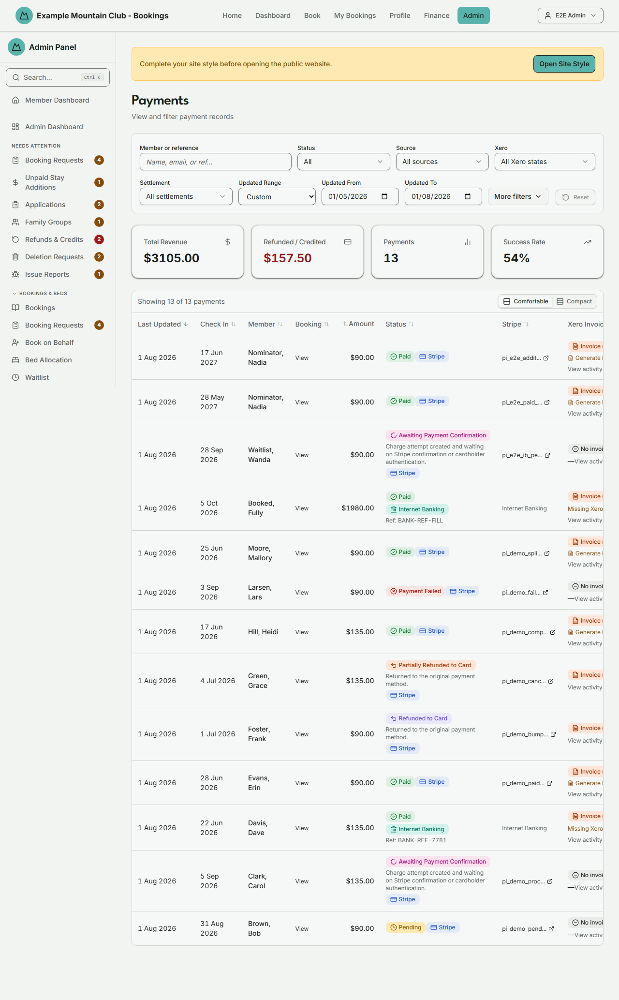

# Payments

Audience: Operator

## What it is

A filterable, sortable ledger of every booking payment — Stripe card payments
and Internet Banking bank transfers — showing the amount, status, Stripe link,
Xero invoice state, and any cancellation-settlement breakdown, with an inline
action to generate a missing Xero invoice. Find it at **Admin → Finance →
Payments** (`/admin/payments`).

Payments is a **finance** permission area: you need finance view access to open
it, and finance **edit** access to generate invoices. Amounts are stored as
integer cents and shown as dollars.

## When you'd use it

- A member asks whether their payment went through, or for a receipt/invoice.
- You are reconciling Stripe or Internet Banking payments against bookings.
- A payment is refunded or credited and you want to see the settlement
  breakdown.
- A successful payment has no Xero invoice yet and you want to generate one.

## Step-by-step

### Open and read the ledger

1. Go to **Admin → Finance → Payments**. The stat cards summarise the current
   filter (Total Revenue, Refunded / Credited, Payments count, Success Rate),
   and the table lists each payment.

   

2. Each row shows the last-updated date, check-in, member, a **View** link to
   the booking, the amount, the status chip (with a Stripe or Internet Banking
   sub-chip), the Stripe payment link, and the Xero invoice state.

### Find a payment

1. Type a name, email, or payment reference into **Member or reference**.
2. Narrow with **Status**, **Source** (Stripe / Internet Banking), **Xero**
   state, **Settlement** kind, and the **Updated** date range. Open **More
   filters** for exact/min/max amount and a check-in date range. Click **Clear**
   to reset.

### Generate a missing Xero invoice

1. Find a **Paid** (succeeded) Stripe payment whose Xero column shows **Invoice
   missing**.
2. Click **Generate Invoice**. The chip changes to **Queued** while Xero
   processes it. This action needs finance edit access; a view-only finance role
   sees it disabled.

### Record a payment made in cash or by an off-Xero bank transfer

Some money never reaches the app: a member pays cash at the lodge, or makes a
bank transfer for a club that does not use Xero invoicing.

1. Open the booking (Admin → Bookings → the booking, or **View** from this
   page) and find **Cash / off-Xero payment** in the **Admin tools** card.
2. Click **Record manual payment**. The dialog shows the exact amount owing
   (after any account credit already applied), takes an optional note for the
   club's records, and asks whether the member should be emailed the usual
   booking confirmation. The payment is recorded either way, and your choice is
   written to the audit log. If the booking's **No emails** switch is on, the
   dialog says so instead of offering the choice.
3. The booking becomes **Paid** and its beds are claimed, exactly as a card
   payment would. Nothing is sent to Xero: no invoice is created, and none is
   emailed.

If the member had saved a choice to put account credit towards this booking
(ticked "use my credit" and saved the booking as a draft) and that credit was
never applied, recording the cash clears the saved choice rather than spending
their credit — the money you collected settled the booking in full, so their
credit balance is untouched. The booking's history tells the member their
credit was not used and is still available, and the admins are alerted so
someone can decide whether to refund the difference or leave the credit for
their next stay.

Needs finance **edit** access. It is refused — with the reason shown — when the
booking already has a Xero invoice (or one queued), when it was settled as part
of a group booking, when there is nothing owing, when the booking no longer fits
the lodge, or when the amount changed while your screen was open. Recording it
against the Xero invoice in Xero is the right move in the first case.

**Reversing it.** If you recorded it against the wrong booking, use **Reverse
manual payment** on the same card. The booking goes back to unpaid — it is *not*
cancelled — and the member is not emailed. A booking restored to
awaiting-payment stops holding its beds, so other bookings can take them, and
recording the payment again later can be refused if the lodge has filled in the
meantime. This is only possible while nothing has happened since that a
reversal could not undo: no refund, no card payment, no open refund task, and
no Xero invoice.

### Pay back a refund for a cash booking

When a booking that was paid in cash is cancelled, there is no card charge to
reverse, so the system raises a task instead of pretending money moved. It
appears at the top of this page as **Refunds to pay back by hand**, and the
member is told the club will arrange their refund.

1. Pay the member back however the club normally does.
2. Click **Mark paid back** on the task. Only do this once the money has
   actually gone — that click is what records the refund in the payment ledger
   and on the booking's history.
3. If the member declined the refund, or it was settled another way, click
   **Dismiss** and say which. A note is required.

### Follow a payment into Stripe or Xero

1. Click the Stripe id to open the payment in the Stripe dashboard, or the Xero
   invoice link to open the invoice in Xero. **View activity** opens the record
   activity log for the payment.

## Settings reference

Payments is a read-only ledger (aside from Generate Invoice). Its controls:

| Control | What it does | Default | Notes / constraints |
| --- | --- | --- | --- |
| Member or reference | Free-text search on member or reference | empty | — |
| Status | Filter by payment status | All | Pending, Processing, Succeeded, Failed, Refunded/Credited, Partially Refunded/Credited |
| Source | Filter by payment method | All sources | Stripe or Internet Banking |
| Xero | Filter by Xero invoice/activity state | All Xero states | Invoice linked/missing, failed/partial/pending activity |
| Settlement | Filter by cancellation-settlement kind | All settlements | None, Card refund, Account credit, Mixed, Restored credit |
| Updated range | Filter by last-updated date | last 3 months | NZ date-only, club time zone |
| Amount exact / min / max | Filter by amount | empty | Entered in dollars |
| Check-in range | Filter by booking check-in | empty | NZ date-only |
| Generate Invoice | Create a Xero invoice for a succeeded payment | — | Needs finance **edit**; only for succeeded, non-Internet-Banking payments with no invoice. Never offered for a manually recorded cash payment — no invoice is expected for one |
| Record / Reverse manual payment | Record a cash or off-Xero bank-transfer settlement on a booking, or undo one | — | On the booking page, not here. Needs finance **edit**. Never contacts Xero |
| Mark paid back / Dismiss | Close a hand-back task for a cancelled cash booking | — | Needs finance **edit**. "Mark paid back" writes the refund into the ledger; "Dismiss" needs a note |

Page size is fixed at 25. **Total Revenue** and **Refunded / Credited** reflect
the whole filtered set; **Success Rate** is computed from the visible page.

## Troubleshooting

| Symptom | Likely cause | Fix |
| --- | --- | --- |
| "No payments found" | Filters are too narrow, or the date range excludes the payment | Click **Clear** and widen the **Updated** range |
| **Generate Invoice** is disabled | Your finance role is view-only, or the payment is not an eligible succeeded card payment | Ask a finance-edit admin; Internet Banking payments generate invoices differently |
| Xero shows **Failed activity** or **Pending activity** | A Xero sync attempt failed or is still running | Open **View activity**, then retry from the finance/Xero tools |
| A refund isn't reflected | The settlement is still processing, or you filtered it out | Check the **Settlement** filter and the row's settlement breakdown |
| Amounts look off by 100× | Amounts are stored as cents and shown as dollars | Enter amount filters in dollars (for example `90.00`) |
| **Record manual payment** says there is a Xero invoice | The booking already has an invoice in Xero, or one is queued | Record the payment against that invoice in Xero instead — recording it here would leave the two systems permanently disagreeing |
| An admin alert says a cash settlement and a Xero payment disagree | The member (or their employer) later paid the Xero invoice for a booking already recorded as paid in cash | Check whether the two are genuinely separate money. Reverse the manual record, or refund the duplicate — the system deliberately changed nothing |
| **Reverse manual payment** is not offered | A refund, a card payment, an open hand-back task or a Xero invoice has appeared since | Cancel the booking instead; a reversal can no longer be undone cleanly |

## Related links

- Back to the [documentation hub](../README.md).
- Feature hub: [Finance dashboard](../finance-dashboard/README.md).
- Sibling guides: [Reports](reports.md), [Bookings](bookings.md),
  [Booking Requests](booking-requests.md).
- Reference: the
  [payment lifecycle](../STATE_MACHINES.md#payment-lifecycle) and
  [refund and credit lifecycle](../STATE_MACHINES.md#refund-and-credit-lifecycle),
  the [Stripe](../ARCHITECTURE.md#stripe) and
  [operational Xero](../ARCHITECTURE.md#operational-xero) boundaries, and
  [payment and settlement invariants](../DOMAIN_INVARIANTS.md#payment-and-settlement).
