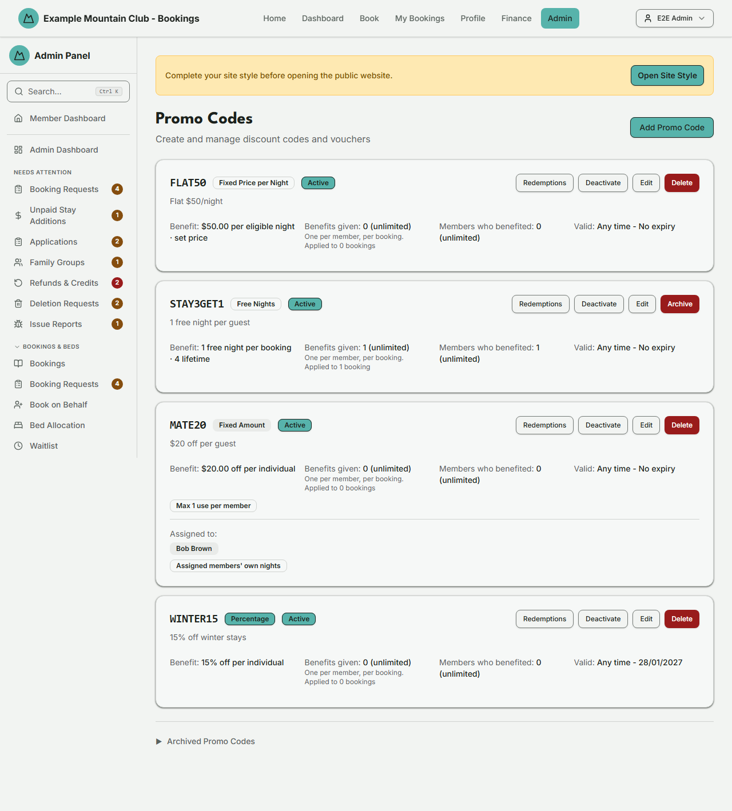

# Promo Codes

Audience: Operator

## What it is

The page for creating and managing discount codes and vouchers — percentage
off, a fixed amount off, free nights, or a fixed nightly price — with usage
caps, date windows, member restrictions, and optional Xero accounting codes.
Find it at **Admin → Rates & Policies → Promo Codes**
(`/admin/promo-codes`).

Managing promo codes needs **bookings edit** access. The create/edit form can
also pull your Xero chart of accounts and items; if your role has no finance
access, those fields fall back to plain text entry. Money is entered in dollars
and stored as integer cents; dates are NZ date-only lodge nights.

## When you'd use it

- You are running an early-bird or seasonal discount and need a code members can
  enter at booking.
- You want to give specific members a personal voucher (for example free nights
  as a prize or thank-you).
- You want to cap how many times a code can be used, or restrict it to certain
  dates, lodges, or members.
- You need to deactivate, archive, or restore a code.

## Step-by-step

### Review existing codes

1. Go to **Admin → Rates & Policies → Promo Codes**. Each active code is a card
   showing the code, its type badge, its benefit, **Benefits given** (how many
   times the code has actually changed someone's price — counted once per member
   per booking, which is what the total-uses limit counts), **Members who
   benefited**, and validity, plus **Deactivate**, **Edit**, and
   **Delete**/**Archive** actions. Underneath the benefits figure the card always
   says how many bookings the code has been applied to, and how many of those
   applications gave nobody anything — a useful hint that a code is
   misconfigured for the stays people are actually booking.

   

   > The screenshot predates the label change and still shows the older
   > "Redemptions" / "Unique members" wording; it needs a manual refresh.

2. Open the **Archived Promo Codes** section at the bottom to see and restore
   archived codes.

### Create a code

1. Click **Add Promo Code**.
2. Enter a **Code** (auto-uppercased, for example `WINTER20`) and an optional
   **Description**.
3. Choose the **Discount Type** and fill the fields it reveals:
   - **Percentage Off** — a percentage per individual (1–100).
   - **Fixed Amount Off** — an amount off per individual (NZD).
   - **Free Nights** — free nights per individual, with an optional lifetime cap.
   - **Fixed Price per Night** — a fixed nightly price per eligible individual,
     used either as a set price or a cap.
4. Set any **Usage limits** (guests per booking, unique members, uses per
   member, total redemptions — leave blank for no limit) and any date windows.
   Only an application that actually delivered a benefit — money off, a price
   change in either direction, or a subsidised night — counts toward these
   limits. If a member applies the code and it works out to exactly nothing for
   their booking (a percentage or fixed amount off nights that are already free,
   or a fixed nightly price that happens to equal what they already pay), the
   application is still recorded in the redemptions report but uses up none of
   their allowance, and none of the code's.

   Note that a fixed nightly price used as a **cap** that never bites is a
   different case: the code simply does not apply to that booking at all, so
   nothing is recorded for it either way.
5. Set the flags — **Members only**, **Member guests only**, **Active** — and,
   if you use Xero, the optional item/account codes. Optionally restrict the
   code to specific lodges (multi-lodge) or assign it to specific members.
6. Click **Create Promo Code**.

### Deactivate, archive, or restore

1. Use **Deactivate** to stop a code being used without deleting it. A code
   that has been redeemed is **archived** rather than deleted (its history is
   kept); use **Restore** from the Archived section to bring it back.

### See who redeemed a code

1. Click **Redemptions** on any code (active, archived, or an internal
   work-party code) to open its redemption report. This view is available to
   view-only bookings admins as well — it changes nothing.
2. The tiles at the top come in two groups, and each tile says which it belongs
   to. **Applications**, **Members who applied it**, **Total discounted** and
   **Free nights used** count applications of the code and follow the filter you
   have set. **Benefits given** and **Members who benefited** are the two the
   usage limits are enforced against: they count only applications that changed
   someone's price, they are always all-time whatever the filter, and they are
   the tiles that carry a progress bar toward a cap.

   This report deliberately lists *every* application of the code, including any
   that delivered no benefit. Those rows are tagged **No benefit** in the member
   column, and the Applications tile tells you how many there are in total. Do
   not read a `$0.00` discount as "no benefit" on its own — a fixed nightly
   price set *above* a guest's normal rate raises their price, which is a real
   use with no discount; those rows show the price increase underneath the
   discount figure.
3. Filter by **redeemed date range** (quick presets or custom dates) and, on a
   multi-lodge site, by **lodge**. The tiles and table recompute for the filter;
   the tiles also show the all-time figure alongside the filtered one.
4. Each table row is one booking's redemption: when it was redeemed, the member
   (name and email, linking to their profile), the booking reference (linking to
   the booking), the lodge, the stay dates and nights, the eligible guest count,
   the discount, and the free nights used. A **Use #N** badge marks a member's
   second or later use of the code.
5. Bookings that split the promo across several members show an expander;
   open it to see each member's share of the discount and free nights.
6. Click **CSV** to download the full filtered list. The export is fetched in a
   single request and is recorded in the audit log as a privacy event (the
   applied filters and the row count only — never the redemption rows
   themselves); ordinary paginated browsing of the report is not audited.

### What happens when a booking is edited and the code has run out

A promotion's usage limits are enforced again every time a booking is repriced —
a date change, guests added or removed, or an edit made from the booking's Edit
panel. Between the day the booking was made and the day it is edited, other
members may have used the code up.

When that happens the club's rule is deliberately generous, and it is worth
knowing so you can answer a member who asks:

- **The edit always goes through.** Nobody is ever blocked from changing their
  dates because somebody else used a promo code.
- **Everyone who was already getting the discount keeps it.** It is never taken
  back, and the member is never billed the difference for a change of dates.
- **Anyone the edit newly adds is priced at the normal rate** if the code has no
  room left for them. When there is not enough room for everybody, the people
  already getting the discount keep it, and the remaining room goes to the
  guests with the most expensive stays first — so the code is worth as much as
  it can be to the booking. (This is the same rule that decides who a
  "max guests per booking" limit covers, so the two never disagree.)
- **The member is told at the moment of the edit**, before they save, in one
  sentence naming who keeps the discount, who this edit has brought under it,
  and who is not covered, and stating that the total on screen already reflects
  it. The same sentence goes into their booking-modified email and onto the
  booking's own history, so nobody has to reconstruct it later. The redemptions
  report shows exactly who benefited.
  - The check is run once for the preview and again when the edit is saved, so
    if somebody else takes the last place in between, the panel shows the saved
    answer before it closes. The member reads what actually happened, not what
    was expected to happen.

Two consequences to expect:

- If you **lower a limit** on a code members are already using, the bookings
  that already have the discount keep it. **Benefits given** can therefore sit
  above the new limit for a while. That is correct, not a fault — the club
  honours what it already promised — and the figure comes back under the limit
  as those bookings pass. No new member is given the code while it is over.
  This holds for a free-nights limit too: a member who already has free nights
  on a booking keeps exactly those nights, even if the lifetime limit has since
  been lowered below them.
- If a code is completely used up and nobody on the booking was benefiting from
  it, the edit removes the code from the booking rather than pretending it still
  applies. Nobody loses anything, because nobody had anything.

## Settings reference

| Setting | What it controls | Default | Notes / constraints |
| --- | --- | --- | --- |
| Code | The text members enter | — | Required; auto-uppercased |
| Discount Type | Percentage / Fixed Amount / Free Nights / Fixed Price per Night | Percentage | Reveals type-specific fields |
| Percentage / Amount / Free nights / Fixed nightly price | The discount value | — | Percent 1–100; money in dollars stored as cents |
| Fixed nightly mode | Set everyone to this price, or use as a cap | Cap only | Fixed-price type only |
| Max nightly value covered | Cap the discount applied to any one night | unlimited | Percentage and Free Nights only |
| Usage limits | Guests/booking, unique members, uses/member, total redemptions | unlimited | Blank = no limit; only applications that gave a benefit count |
| Valid From / Until, Check-in From / Until | When the code and eligible stays apply | none | NZ date-only |
| Members only / Member guests only | Restrict who the code applies to | off | — |
| Active | Whether the code can be used now | on | — |
| Xero Item Code / Account Code | Post the discount line to a specific Xero item/account | none | Item's mapped account wins over the account code |
| Restrict to Lodges | Limit redemption to chosen lodges | all lodges | Multi-lodge only |
| Assign to Specific Members | Limit use to named members, with a scope choice | none | Own-nights-only or whole booking |

## After upgrading to this release

Usage limits used to count *any* application of a code, even one that gave the
member nothing. They now count only applications that actually changed someone's
price, and a one-off repair runs during the upgrade to remove the historical
benefit-free entries.

So the first time you open this page after upgrading, expect the **Benefits
given** figure on some cards — and the matching progress bar on the redemptions
report — to be **lower than it was**, sometimes noticeably. Nothing has been
deleted from the history: every application is still listed on the redemptions
report, tagged **No benefit** where that is what it was. A code that looked
exhausted may become usable again, and a member who was told "you have already
used this promo code" for an application that did nothing for them can use it.
That is the intended correction, not a fault.

## Troubleshooting

| Symptom | Likely cause | Fix |
| --- | --- | --- |
| The page is read-only | Your admin role is view-only for bookings | Ask a full admin for bookings edit access |
| **Benefits given** dropped after the upgrade | Benefit-free applications no longer count toward the limits, and the historical ones were cleared | Nothing to do — see [After upgrading to this release](#after-upgrading-to-this-release) |
| A row shows a `$0.00` discount but counts as a use | A fixed nightly price set *above* the guest's normal rate raises their price, which is still a use | Check the price change shown under the discount figure on the redemptions report |
| Xero item/account fields are plain text boxes | Your role has no finance access, or Xero data failed to load | Enter the codes manually, or ask a finance admin — the code still works |
| Delete became Archive | The code has redemptions and its history must be kept | Use Archive; **Restore** it later from the Archived section |
| A code won't apply to a booking | It is inactive, expired, capped out, or restricted to other members/lodges/dates | Check the Active flag, date windows, usage caps, and any member/lodge restriction |
| A member says one guest on their booking got the discount and another did not | The code ran out of uses partway through their edit; everyone who already had it keeps it and new people are priced normally | Nothing to do — see [What happens when a booking is edited and the code has run out](#what-happens-when-a-booking-is-edited-and-the-code-has-run-out); the redemptions report shows who benefited |
| **Benefits given** sits above the limit after you lowered it | Members who already had the discount keep it; the club does not bill back a promise already made | Nothing to do — it comes back under the limit as those bookings pass, and no new member is given the code meanwhile |
| No promo codes appear | None have been created (the demo seed ships none) | Click **Add Promo Code** to create one |

## Related links

- Back to the [documentation hub](../README.md).
- Sibling guides: [Book on Behalf](book.md), [Booking Policies](booking-policies.md),
  [Seasons](seasons.md), [Payments](payments.md).
- Reference: promo application in the
  [booking/payment flow](../ARCHITECTURE.md#booking-and-payment-flow), the
  [payment lifecycle](../STATE_MACHINES.md#payment-lifecycle), and money rules in
  [`DOMAIN_INVARIANTS.md`](../DOMAIN_INVARIANTS.md#money).
