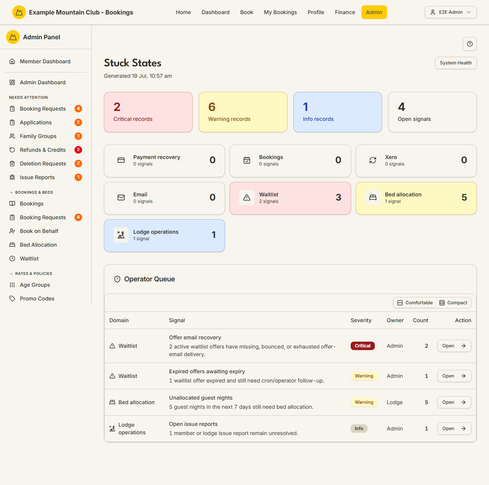

# Stuck States

Audience: Operator

## What it is

A single operator queue for records that have got **stuck** — a payment that
never settled, a booking mid-transition, a Xero sync that didn't complete, an
email that exhausted its retries, a waitlist or bed-allocation edge case. Each
signal is grouped by domain, ranked by severity, given an owner, and linked
straight to the screen where you fix it. Find it at **Admin → Monitoring & Support → Stuck States**
(`/admin/stuck-states`).

The page is read-only and computed on each visit (it shows when it was
generated). It complements [System Health](health.md) (which watches services)
by watching **data** — see [`ARCHITECTURE.md`](../ARCHITECTURE.md)
(stuck-state dashboard).

## When you'd use it

- Your daily sweep for anything that silently fell out of a normal flow.
- A member reports a payment or booking that's "stuck" and you want to find and
  clear it fast.
- After an incident (provider outage, failed deploy) to catch records left
  mid-transition.

## Step-by-step

### Work the queue

1. Go to **Admin → Stuck States**. The summary tiles show the count of
   **Critical**, **Warning**, and **Info** records and the total open signals.

   

2. Scan the **per-domain cards** (payment, booking, Xero, email, waitlist, bed
   allocation, lodge) for where the problem is.
3. In the **Operator Queue** table, each row names the signal, its severity, its
   owner, and a count. Click **Open** to go straight to the screen that resolves
   it. An empty queue shows "No stuck states found."

## Settings reference

The page has no settings. What it shows:

| Element | Meaning |
| --- | --- |
| Summary tiles | Counts of Critical / Warning / Info records and total open signals |
| Domain cards | Per-domain (payment, booking, Xero, email, waitlist, bed allocation, lodge) counts and highest severity |
| Operator Queue | One row per signal: domain, description, severity, owner, count, and an **Open** link to the fix screen |
| Generated timestamp | When the dashboard was last computed (shown in the header) |

### Who sees the named rows

A few signals expand into a short list naming the individual members or bookings
behind the count — **Members with no reachable email address** lists the members,
and **Bookings without required adult member cover** names each booking's owner.
Those named rows are membership-roll detail, so they appear **only if you also
have Membership view access**. An admin with Stuck States access but not
Membership sees the same signal, the same count, and the same **Open** link to
work it — just not the individual names and per-member deep links. This keeps
the queue useful to support staff (they can see a problem exists and hand it on)
without widening who can read the membership roll.

## Troubleshooting

| Symptom | Likely cause | Fix |
| --- | --- | --- |
| **Bookings with unnamed guests** shows a count | An upcoming school/organisation or member whole-lodge booking still lists generated placeholders ("Guest 2", "School Child 5"), so the chore list and arrival roster would print those instead of real people | Most bookers are chased automatically as check-in approaches, but not all of them: a school list the contact already **confirmed** while leaving the placeholder names in place gets no further prompt, and a booking still held for approval is not chased at all. So work the list — open each booking and edit the guest names yourself. Renaming a guest does not change their age group or the price. **This never holds up a stay** — the booking, check-in and [Chore Roster](roster.md) all work exactly as normal while the count stands |
| **Bookings without required adult member cover** shows a count | A booking that was confirmed with the adult-member cover the club requires has since lost it — an officer overrode the refusal, a membership lapsed, another booking on the same account was cancelled, or a payment or lifecycle change removed the person who was covering it. It only appears where the lodge is set to **stop** a non-compliant booking and to allow cover from another booking on the same account (see [Booking Policies](booking-policies.md)) | Open the booking. Four things clear it, and any one of them is enough: put a qualifying adult member back on the party or on another confirmed booking on the same account for those nights, amend the booking so the uncovered nights go away, approve a policy exception for it, or cancel it. The entry clears itself once one of those is true — there is nothing to tick off. **The stay is never held up over this and nothing is ever cancelled automatically**: the beds and the payments are untouched while the count stands, and the booking owner has already been emailed once about it |
| A signal reappears after you act | The underlying record is still in the stuck state | Follow the **Open** link and complete the resolution there; the signal clears on the next generation |
| A payment/Xero signal is Critical | A settlement or sync didn't complete | Open it and reconcile; see [Payments](payments.md) / [Xero Sync](xero.md) |
| An email signal shows exhausted failures | Delivery retries ran out | Investigate in [Email Deliverability](email-deliverability.md) |
| Counts look stale | The dashboard is computed per visit | Reload the page to regenerate |

## Related links

- Back to the [documentation hub](../README.md).
- Sibling monitoring guides: [System Health](health.md),
  [Background Jobs](background-jobs.md), [Email Deliverability](email-deliverability.md),
  [Audit Log](audit-log.md).
- Reference: the stuck-state dashboard in [`ARCHITECTURE.md`](../ARCHITECTURE.md).
